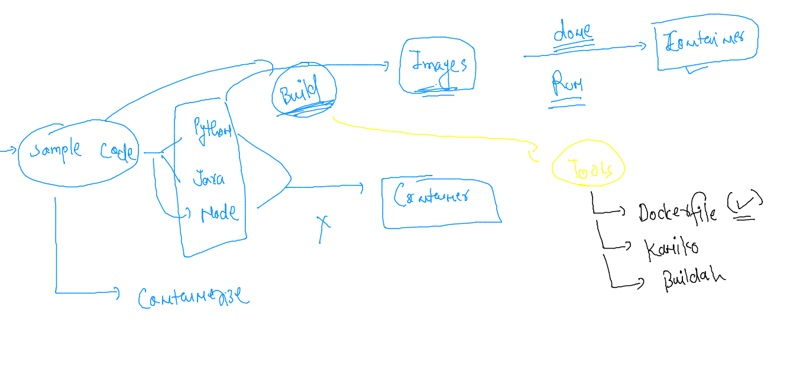
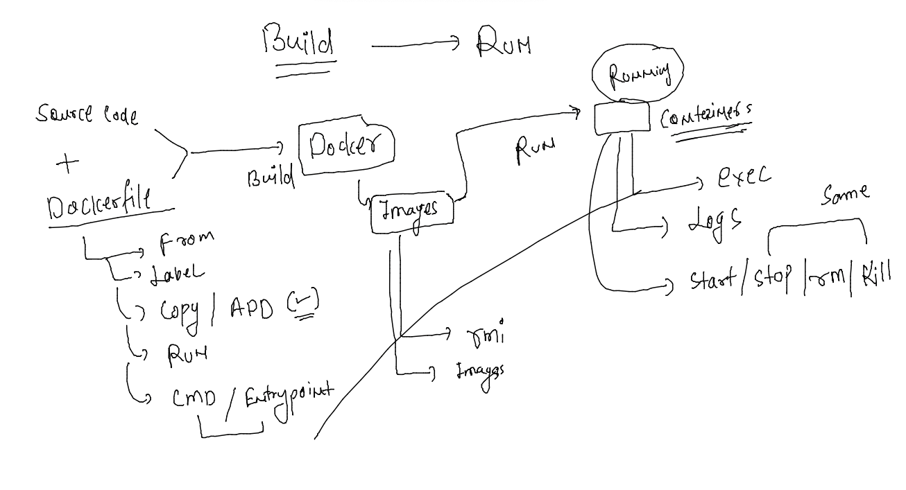

# oracle-docker-k8s1st_aug2022

### training plan 


###  app testing / deployment related problems in History 


### Introduction to HyperVisor 


### from app point of view -- vm are heavy and having unwanted LIbs 


### app need few amount of resources and LIbs from OS 


### Introduction to containers 


### vm vs containers 


### Creating and managing continers we need COntainer runtimes -- Docker is the One we R using 


### installing docker on Oracle linux 7.9 

### Checking os Details 

```
[root@docker-server ~]# cat /etc/os-release 
NAME="Oracle Linux Server"
VERSION="7.9"
ID="ol"
ID_LIKE="fedora"
VARIANT="Server"
VARIANT_ID="server"
VERSION_ID="7.9"
PRETTY_NAME="Oracle Linux Server 7.9"
```


### installing docker 

```
[root@docker-server ~]# yum  install docker  
Failed to set locale, defaulting to C
Loaded plugins: langpacks, ulninfo
ol7_MySQL80                                                                                    | 3.0 kB  00:00:00     
ol7_MySQL80_connectors_community                                                               | 2.9 kB  00:00:00     
ol7_MySQL80_tools_community                                                                    | 2.9 kB  00:00:00     
ol7_UEKR6                                                                                      | 3.0 kB  00:00:00     
ol7_addons                  
```

### start docker service 


```
[root@docker-server ~]# systemctl start docker
[root@docker-server ~]# systemctl enable  docker
Created symlink from /etc/systemd/system/multi-user.target.wants/docker.service to /usr/lib/systemd/system/docker.service.
[root@docker-server ~]# systemctl status   docker
● docker.service - Docker Application Container Engine
   Loaded: loaded (/usr/lib/systemd/system/docker.service; enabled; vendor preset: disabled)
   Active: active (running) since Mon 2022-08-01 06:13:36 GMT; 14s ago
     Docs: https://docs.docker.com
 Main PID: 17412 (dockerd)
   CGroup: /system.slice/docker.service
           └─17412 /usr/bin/dockerd -H fd:// --containerd=/run/containerd/containerd.sock
```

### accessing docker server as docker client 

```
[root@docker-server ~]# useradd  ashu
[root@docker-server ~]# 
[root@docker-server ~]# su - ashu 
[ashu@docker-server ~]$ 
[ashu@docker-server ~]$ 
[ashu@docker-server ~]$ docker version 
Client: Docker Engine - Community
 Version:           19.03.11-ol
 API version:       1.40
 Go version:        go1.16.2
 Git commit:        9bb540d
 Built:             Fri Jul 23 01:33:55 2021
 OS/Arch:           linux/amd64
 Experimental:      false
Got permission denied while trying to connect to the Docker daemon socket at unix:///var/run/docker.sock: Get "http://%2Fvar%2Frun%2Fdocker.sock/v1.40/version": dial unix /var/run/docker.sock: connect: permission denied
[ashu@docker-server ~]$ logout
[root@docker-server ~]# 
[root@docker-server ~]# 
[root@docker-server ~]# 
[root@docker-server ~]# usermod -aG docker  ashu 
[root@docker-server ~]# su - ashu 
Last login: Mon Aug  1 06:15:24 GMT 2022 on pts/0
[ashu@docker-server ~]$ docker  version 
Client: Docker Engine - Community
 Version:           19.03.11-ol
 API version:       1.40
 Go version:        go1.16.2
 Git commit:        9bb540d
 Built:             Fri Jul 23 01:33:55 2021
 OS/Arch:           linux/amd64
 Experimental:      false

Server: Docker Engine - Community
 Engine:
  Version:          19.03.11-ol
  API version:      1.40 (minimum version 1.12)
  Go version:       go1.16.2
  Git commit:       9bb540d
  Built:            Fri Jul 23 01:32:08 2021
  OS/Arch:          linux/amd64
  Experimental:     false
  Default Registry: docker.io
 containerd:
  Version:          v1.4.8
  GitCommit:        7eba5930496d9bbe375fdf71603e610ad737d2b2
 runc:
  Version:          1.1.1
  GitCommit:        52de29d
 docker-init:
  Version:          0.18.0
  GitCommit:        fec3683

```

### connection from laptops 


```
fire@ashutoshhs-MacBook-Air ~ % ssh  ashu@129.146.176.49  
The authenticity of host '129.146.176.49 (129.146.176.49)' can't be established.
ECDSA key fingerprint is SHA256:JMuT6ywZUzrVDk8X5lB4+mOmgWCZuYLFV8IiQyHSr10.
Are you sure you want to continue connecting (yes/no/[fingerprint])? yes
Warning: Permanently added '129.146.176.49' (ECDSA) to the list of known hosts.
ashu@129.146.176.49's password: 
Last login: Mon Aug  1 06:15:44 2022
-bash: warning: setlocale: LC_CTYPE: cannot change locale (UTF-8): No such file or directory
[ashu@docker-server ~]$ 
[ashu@docker-server ~]$ 
[ashu@docker-server ~]$ 
[ashu@docker-server ~]$ docker  version 
Client: Docker Engine - Community
 Version:           19.03.11-ol
 API version:       1.40
 Go version:        go1.16.2
 Git commit:        9bb540d
 Built:             Fri Jul 23 01:33:55 2021
 OS/Arch:           linux/amd64
 Experimental:      false

Server: Docker Engine - Community
 Engine:
  Version:          19.03.11-ol
  API version:      1.40 (minimum version 1.12)
  Go version:       go1.16.2
  Git commit:       9bb540d
  Built:            Fri Jul 23 01:32:08 2021
  OS/Arch:          linux/amd64
  Experimental:     false
  Default Registry: docker.io
 containerd:
  Version:          v1.4.8
  GitCommit:        7eba5930496d9bbe375fdf71603e610ad737d2b2
 runc:
  Version:          1.1.1
  GitCommit:        52de29d
 docker-init:
  Version:          0.18.0
  GitCommit:        fec3683

```

### pulling image from Docker hub 

```
[ashu@docker-server ~]$ docker  images
REPOSITORY          TAG                 IMAGE ID            CREATED             SIZE
[ashu@docker-server ~]$ 
[ashu@docker-server ~]$ 
[ashu@docker-server ~]$ docker  pull   mysql 
Using default tag: latest
Trying to pull repository docker.io/library/mysql ... 
latest: Pulling from docker.io/library/mysql
e54b73e95ef3: Pull complete 
327840d38cb2: Pull complete 
642077275f5f: Pull complete 
e077469d560d: Pull complete 
cbf214d981a6: Pull complete 
f4fda5f8b9a8: Pull complete 
a41c2763043b: Pull complete 
f86b3df6abb1: Pull complete 
95b1c2ed2ecf: Pull complete 
b0edcd52771b: Pull complete 
a3d312b5c835: Pull complete 
Digest: sha256:657d78ee56e09101902673adcdd7d2bf03012e759c1aa525eeca28cb0fe1aa7d
Status: Downloaded newer image for mysql:latest
mysql:latest
[ashu@docker-server ~]$ docker  images
REPOSITORY          TAG                 IMAGE ID            CREATED             SIZE
mysql               latest              38643ad93215        5 days ago          446MB
[ashu@docker-server ~]$ 

```

### pulling images from different container registries

```
    6  docker  pull   mysql 
    7  docker  images
    8  history 
    9  docker pull quay.io/jitesoft/nginx
   10  docker images
   11  docker pull container-registry.oracle.com/java/openjdk:latest
   12  history 
[ashu@docker-server ~]$ docker  images
REPOSITORY                                   TAG                 IMAGE ID            CREATED             SIZE
mysql                                        latest              38643ad93215        5 days ago          446MB
quay.io/jitesoft/nginx                       latest              fe095d988a2a        11 days ago         50.8MB
container-registry.oracle.com/java/openjdk   latest              a0a677f4434e        12 days ago         569MB
[ashu@docker-server ~]$ 


```

### importance of process in container 


### creating containers 


### creating first container 

```
[ashu@docker-server ~]$ docker  run  alpine:latest   cal 
    August 2022
Su Mo Tu We Th Fr Sa
    1  2  3  4  5  6
 7  8  9 10 11 12 13
14 15 16 17 18 19 20
21 22 23 24 25 26 27
28 29 30 31
                     
[ashu@docker-server ~]$ docker  ps
CONTAINER ID        IMAGE               COMMAND             CREATED             STATUS                  PORTS               NAMES
12ba14a8ab75        alpine:latest       "cal"               1 second ago        Up Less than a second                       nice_carson
[ashu@docker-server ~]$ docker  ps
CONTAINER ID        IMAGE               COMMAND             CREATED             STATUS              PORTS               NAMES
[ashu@docker-server ~]$ 


```

### best practise to give some name to containers 

```
[ashu@docker-server ~]$ docker  run --name ashuc1   alpine:latest   cal 
    August 2022
Su Mo Tu We Th Fr Sa
    1  2  3  4  5  6
 7  8  9 10 11 12 13
14 15 16 17 18 19 20
21 22 23 24 25 26 27
28 29 30 31
                     
[ashu@docker-server ~]$ docker  ps -a
CONTAINER ID        IMAGE               COMMAND             CREATED             STATUS                      PORTS               NAMES
631357712a71        alpine:latest       "cal"               5 seconds ago       Exited (0) 4 seconds ago                        ashuc1
3fb37fa063a5        alpine              "env"               6 seconds ago       Exited (0) 5 seconds ago                        skotha1
4700b2a043f5        alpine:latest       "cal"               19 seconds ago      Exited (0) 18 seconds ago                       uday
571338ca2b06        alpine:latest       "cal"               21 seconds ago      Exited (0) 20 seconds ago                       mvu
[ashu@docker-server ~]$ 


```

### best way to create contianer 

```
ashu@docker-server ~]$ docker  run --name ashuc1 -d    alpine:latest   ping www.google.com 
63d292bcf988cb59c11d9b4b01ad3532146161102163dad1b45bc86fae2a53bf
[ashu@docker-server ~]$ 
[ashu@docker-server ~]$ 
[ashu@docker-server ~]$ docker  ps
CONTAINER ID        IMAGE               COMMAND                 CREATED             STATUS              PORTS               NAMES
3375480fabf2        alpine:latest       "ping www.google.com"   3 seconds ago       Up 2 seconds                            priyamva
63d292bcf988        alpine:latest       "ping www.google.com"   12 seconds ago      Up 11 seconds                           ashuc1
[ashu@docker-server ~]$ 

```

### stop a running container 

```
[ashu@docker-server ~]$ docker  stop  ashuc1
ashuc1

```

### starting container 

```
[ashu@docker-server ~]$ docker  start  ashuc1
ashuc1
```

### we can get the shell of a running container 

```
[ashu@docker-server ~]$ docker exec -it  ashuc1  sh  
/ # 
/ # 
/ # whoami
root
/ # ls 
bin    dev    etc    home   lib    media  mnt    opt    proc   root   run    sbin   srv    sys    tmp    usr    var
/ # exit


```

### how to remove container 

```
[ashu@docker-server ~]$ docker  stop  ashuc1
ashuc1
[ashu@docker-server ~]$ docker  rm  ashuc1 
ashuc1
```


## app containerization 

### build & Run 



### Dockerfile Demo 1 

```
FROM python
# From docker hub this image will be pulled if not present 
LABEL name="ashutoshh"
LABEL email="ashutoshh@linux.com"
# label is optional field but you can put your info for contact purpose 
RUN mkdir /code  
# it can run any command which is supported by From Image 
COPY oracle.py /code/
# to copy data from docker client to docker server during image build time
CMD [ "python","/code/oracle.py" ]
# CMD is used to fix default process of container 
# docker run -d --name x1  myimg:v1  ping fb.com 

```

### lets build image 

```
[ashu@docker-server docker-images]$ cd  pythoncodes/
[ashu@docker-server pythoncodes]$ ls
Dockerfile  oracle.py
[ashu@docker-server pythoncodes]$ docker  build  -t  python:ashucodev1 . 
Sending build context to Docker daemon  3.072kB
Step 1/6 : FROM python
Trying to pull repository docker.io/library/python ... 
latest: Pulling from docker.io/library/python
d836772a1c1f: Pull complete 
66a9e63c657a: Extracting  2.
```

### image list 

```
[ashu@docker-server pythoncodes]$ docker  images
REPOSITORY          TAG                 IMAGE ID            CREATED             SIZE
python              priyankacodev1      a6c8a919dfad        8 seconds ago       920MB
python              ashucodev1          6b8d7b99edf1        9 seconds ago       920MB
pyhton              vishwascodev1       b31f60baaad5        9 seconds ago       920MB
```

### creating container from images 

```
[root@docker-server docker]# docker  run -itd --name ashuc4 python:ashucodev2
e5f813e5d78cfd0e1304aa4e5c7535ce336f52c50de00011cffae47e623af7a9
[root@docker-server docker]# docker logs -f  ashuc4 
Hello all , welcome to python..!!
Welcome to Oracle India ..
Welcome to Containers ..!!
______________________
Hello all , welcome to python..!!
^C
[root@docker-server
```

### solution to task 2 

### Dockerfile content 

```
FROM alpine
LABEL name="ashutoshh"
RUN apk add python3 && mkdir /code 
COPY oracle.py /code/
ENTRYPOINT python3  /code/oracle.py 


```
-===
```

[ashu@docker-server pythoncodes]$ ls
alpine.dockerfile  Dockerfile  oracle.py
[ashu@docker-server pythoncodes]$ docker  build  -t  ashualp:pycodev1 -f alpine.dockerfile  . 
Sending build context to Docker daemon  4.096kB
Step 1/5 : FROM alpine
 ---> d7d3d98c851f
Step 2/5 : LABEL name="ashutoshh"
 ---> Running in ad93549390bf
Removing intermediate container ad93549390bf
 ---> 69564ab06f46
Step 3/5 : RUN apk add pyt
```
### creating container and checking output 

```
[ashu@docker-server pythoncodes]$ docker run -itd --name ashuxc1 ashualp:pycodev1 
c1be7a96312b23d1908decd4ad7c2c5b948bf4631333dc3ec5ab6af1e8babd6c
[ashu@docker-server pythoncodes]$ docker logs  ashuxc1 
Hello all , welcome to python..!!
Welcome to Oracle India ..
Welcome to Containers ..!!
```

### demo 3 dockerfile 

```
FROM oraclelinux:8.4
LABEL name="ashutoshh"
RUN yum install python3 -y && mkdir /mycode 
ADD https://raw.githubusercontent.com/redashu/pythonLang/main/while.py /mycode/
# copy and ADD both are same but add can accept URL as Source 
CMD [ "python3","/mycode/while.py" ]
```

### learning of the day 




### Dockerfile -- CMD & ENTrypoint 

```
FROM oraclelinux:8.4
LABEL name="ashutoshh"
RUN yum install python3 -y && mkdir /mycode 
ADD https://raw.githubusercontent.com/redashu/pythonLang/main/while.py /mycode/
COPY hello.py  /mycode/
# copy and ADD both are same but add can accept URL as Source 
WORKDIR /mycode 
# to change directory for containers like cd command in unix env 
ENTRYPOINT [ "python3" ]
CMD ["while.py"]
# CMD is replace while creating container as last argument 
# ENTRYPOINT is not replaceable while creating container as last argument


```

### lets build it 

```
docker build -t  python:ashucodev4  -f oracle.dockerfile .
```

### lets test it 

```
 59  docker  run -itd --name test4  python:ashucodev4
 docker  run -itd --name test5  python:ashucodev4  hello.py 
 [root@docker-server docker]# docker  ps
CONTAINER ID        IMAGE               COMMAND              CREATED              STATUS              PORTS               NAMES
3c1f681aa057        python:ashucodev4   "python3 hello.py"   About a minute ago   Up About a minute                       test5
501a74ed1e63        python:ashucodev4   "python3 while.py"   2 minutes ago        Up 2 minutes                            test4
```


