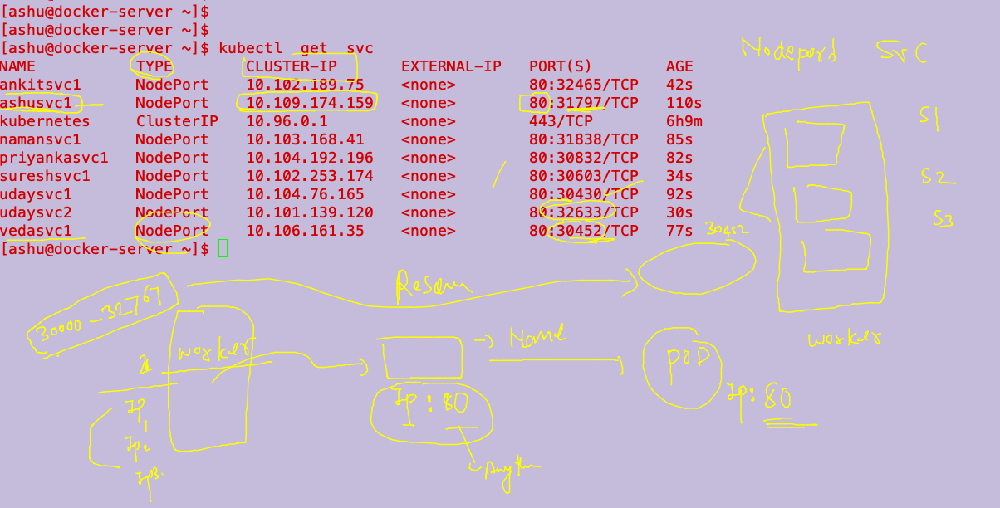
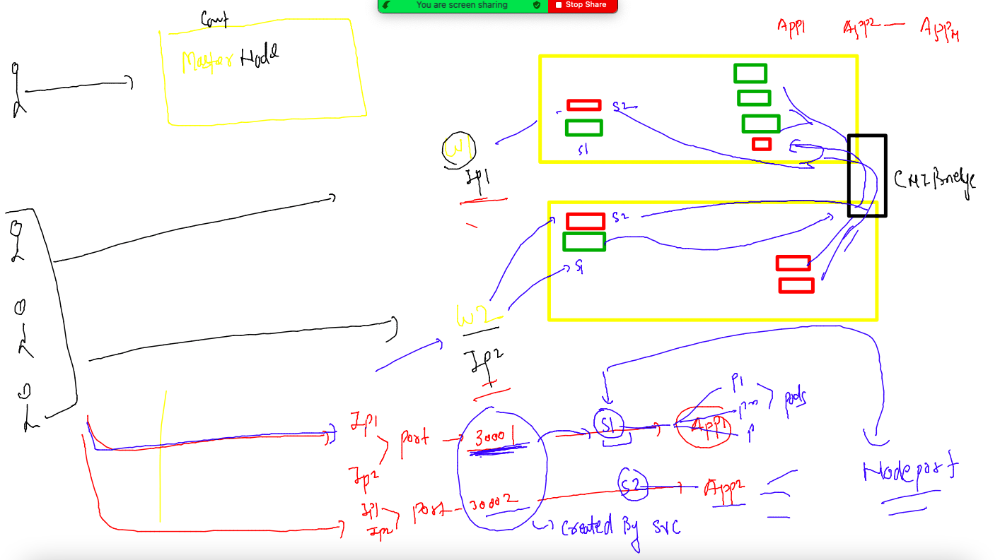
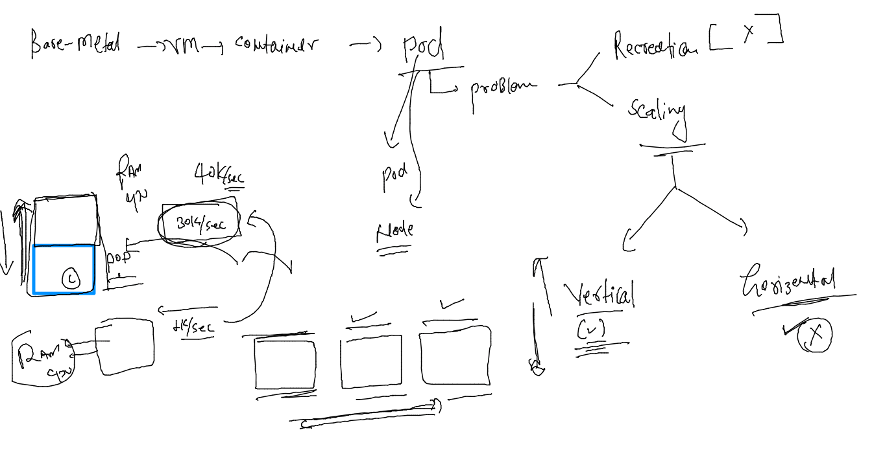
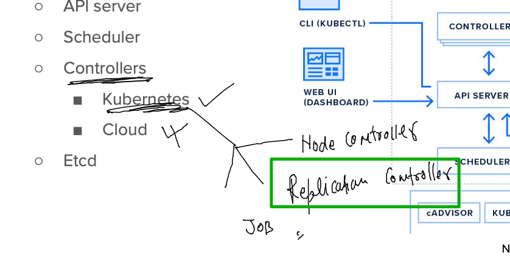
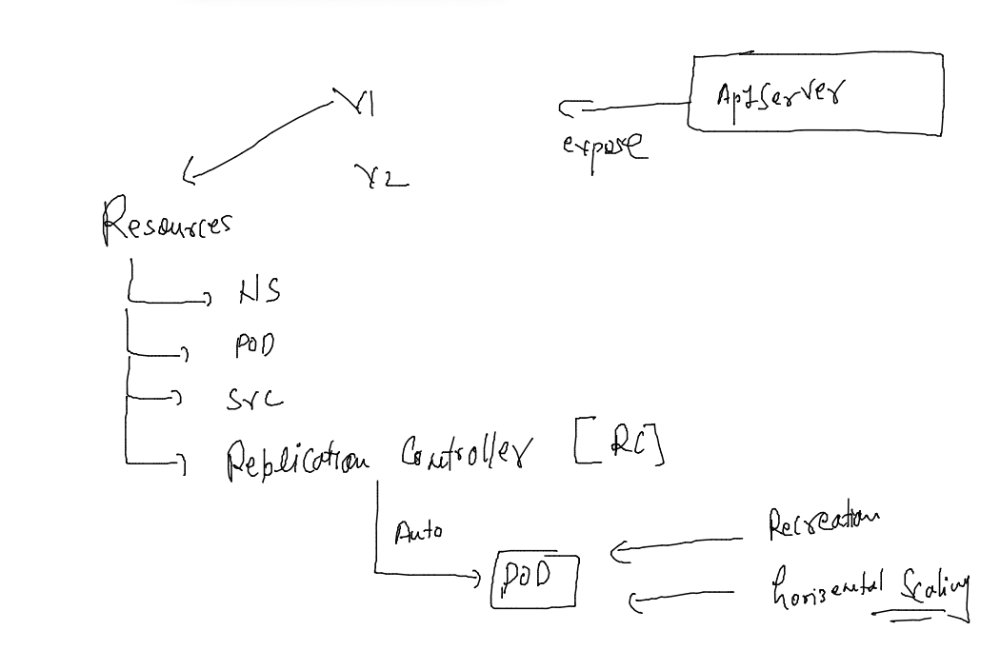

# oracle-docker-k8s1st_aug2022

### training plan 


### installing kubernetes in various platforms / Env 


### install minikube in any platform for k8s setup on local machine 

[install_link](https://minikube.sigs.k8s.io/docs/start/)

### setup 

```
[ashu@docker-server ~]$ minikube version 
minikube version: v1.26.1
commit: 62e108c3dfdec8029a890ad6d8ef96b6461426dc
[ashu@docker-server ~]$ minikube  start 
😄  minikube v1.26.1 on Oracle 7.9 (amd64)
✨  Automatically selected the docker driver
💨  For improved Docker performance, Upgrade Docker to a newer version (Minimum recommended version is 20.10.0, minimum supported version is 18.09.0, current version is 19.03.11-ol)
📌  Using Docker driver with root privileges
👍  Starting control plane node minikube in cluster minikube
🚜  Pulling base image ...
💾  Downloading Kubernetes v1.24.3 preload ...
    > preloaded-images-k8s-v18-v1...:  405.75 MiB / 405.75 MiB  100.00% 103.47 
    > gcr.io/k8s-minikube/kicbase:  386.60 MiB / 386.61 MiB  100.00% 38.45 MiB 
    > gcr.io/k8s-minikube/kicbase:  0 B [_______________________] ?% ? p/s 7.7s
🔥  Creating docker container (CPUs=2, Memory=3900MB) ...
🐳  Preparing Kubernetes v1.24.3 on Docker 20.10.17 ...
    ▪ Generating certificates and keys ...
    ▪ Booting up control plane ...
    ▪ Configuring RBAC rules ...
🔎  Verifying Kubernetes components...
    ▪ Using image gcr.io/k8s-minikube/storage-provisioner:v5
🌟  Enabled addons: storage-provisioner, default-storageclass
🏄  Done! kubectl is now configured to use "minikube" cluster and "default" namespace by default
[ashu@docker-server ~]$ 

```


### setup k8s multinode cluster using kubeadm -- 

[Vidoe_link](https://www.youtube.com/watch?v=TTzbQdu30YA&t=24s)

### auto generating YAML / JSON files for k8s resources 

### pod 

```
[ashu@docker-server ~]$ kubectl  run  ashupod1  --image=nginx --port 80 --dry-run=client -o yaml 
apiVersion: v1
kind: Pod
metadata:
  creationTimestamp: null
  labels:
    run: ashupod1
  name: ashupod1
spec:
  containers:
  - image: nginx
    name: ashupod1
    ports:
    - containerPort: 80
    resources: {}
  dnsPolicy: ClusterFirst
  restartPolicy: Always
status: {}

```

### saving yaml in a file and deploy it 

```
 kubectl  run  ashupod1  --image=nginx --port 80 --dry-run=client -o yaml  >autopod.yaml
[ashu@docker-server k8s-app-deploy]$ kubectl apply -f autopod.yaml 
pod/ashupod1 created
[ashu@docker-server k8s-app-deploy]$ kubectl get  po 
NAME       READY   STATUS              RESTARTS   AGE
ashupod1   1/1     Running             0          15s
udaypod1   0/1     ContainerCreating   0          1s
[ashu@docker-server k8s-app-deploy]$ 
```

### deleting all pods 

```
[ashu@docker-server ~]$ kubectl delete pods --all
pod "ankitpod2" deleted
pod "ashupod1" deleted
pod "namanpod1" deleted
pod "namanpodalt" deleted
pod "priyampod1" deleted

```

###  CMD & ENTRYpoint  vs args & command 


### using command from cli 

```
kubectl run x1 --image=busybox  --command ping fb.com --dry-run=client -o yaml 
apiVersion: v1
kind: Pod
metadata:
  creationTimestamp: null
  labels:
    run: x1
  name: x1
spec:
  containers:
  - command:
    - ping
    - fb.com
    image: busybox
    name: x1

```

### alternativ way 

```
apiVersion: v1
kind: Pod
metadata:
  creationTimestamp: null
  labels:
    run: ashutoshhpod1
  name: ashutoshhpod1
spec:
  containers:
  - image: busybox
    name: ashutoshhpod1
    command: ["sh","-c","ping fb.com"] # in array format 
    resources: {}
  dnsPolicy: ClusterFirst
  restartPolicy: Always
status: {}

```

### history 

```
  378  kubectl run x1 --image=busybox  --command ping fb.com --dry-run=client -o yaml 
  379  kubectl  get po 
  380  kubectl logs  ashutoshhpod1 
  381  kubectl logs  ashutoshhpod1  >logs.txt
  382  hsitor
  383  history 
  384  ls
  385  kubectl exec -it  ashutoshhpod1 -- sh 
  386  kubectl cp logs.txt ashutoshhpod1:/opt/
  387  kubectl exec -it  ashutoshhpod1 -- ls /opt
  388  kubectl get po ashutoshhpod1 -o wide
  389  kubectl exec -it ashutoshhpod1 -- sh 
  390  history 
  391  kubectl exec -it  ashutoshhpod1 --  echo hello  >>/opt/logs.txt
  392  kubectl exec -it  ashutoshhpod1 --  sh -c 'echo hello  >>/opt/logs.txt'
  393  kubectl exec -it ashutoshhpod1 -- cat /opt/logs.txt 
```

### pod networking 


### deploy docker image as webapp

```
kubectl run ashuwebapp --image=dockerashu/ashucustomer:v1   --port 80 --dry-run=client -o yaml >webapp.yaml 
```

### changes in yaml by adding enV section 

```
apiVersion: v1
kind: Pod
metadata:
  creationTimestamp: null
  labels:
    run: ashuwebapp
  name: ashuwebapp
spec:
  containers:
  - image: dockerashu/ashucustomer:v1
    name: ashuwebapp
    ports:
    - containerPort: 80
    resources: {}
    env: # for placing value of ENV variable
    - name: deploy # name of env in Docker image 
      value: webapp2 # value to deploy app 2 
  dnsPolicy: ClusterFirst
  restartPolicy: Always
status: {}

====
[ashu@docker-server k8s-app-deploy]$ kubectl apply -f  webapp.yaml 
pod/ashuwebapp created
[ashu@docker-server k8s-app-deploy]$ kubectl  get po 
NAME             READY   STATUS    RESTARTS   AGE
ashuwebapp       1/1     Running   0          25s
```

### to access app runnng inside k8s we need below given resoures 


### service and understanding and its types


====


### creating nodeport serivce using existing running pod 

```
[ashu@docker-server k8s-app-deploy]$ kubectl expose pod ashuwebapp  --type NodePort --port 80 --name ashusvc1  --dry-run=client -o yaml 
apiVersion: v1
kind: Service
metadata:
  creationTimestamp: null
  labels:
    run: ashuwebapp
  name: ashusvc1
spec:
  ports:
  - port: 80
    protocol: TCP
    targetPort: 80
  selector:
    run: ashuwebapp
  type: NodePort
status:
  loadBalancer: {}
[ashu@docker-server k8s-app-deploy]$ kubectl expose pod ashuwebapp  --type NodePort --port 80 --name ashusvc1  --dry-run=client -o yaml  >nodeportsvc.yaml 
```

### Nodeport understnading 



###

```
10  kubectl expose pod ashuwebapp  --type NodePort --port 80 --name ashusvc1  --dry-run=client -o yaml  >nodeportsvc.yaml 
  411  ls
  412  kubectl apply -f nodeportsvc.yaml 
  
  [ashu@docker-server ~]$ kubectl  get  svc 
NAME           TYPE        CLUSTER-IP       EXTERNAL-IP   PORT(S)        AGE
ankitsvc1      NodePort    10.102.189.75    <none>        80:32465/TCP   42s
ashusvc1       NodePort    10.109.174.159   <none>        80:31797/TCP   110s
kubernetes     ClusterIP   10.96.0.1        <none>        443/TCP        6h9m
namansvc1      NodePort    10.103.168.41    <none>        80:31838/TCP   85s
priyankasvc1   NodePort    10.104.192.196   <none>        80:30832/TCP   82s
sureshsvc1     NodePort    10.102.253.174   <none>        80:30603/TCP   34s
udaysvc1       NodePort    10.104.76.165    <none>        80:30430/TCP   92s
```

### Nodeport once more 



### namespaces in k8s

```
[ashu@docker-server ~]$ kubectl  get   namespaces 
NAME                   STATUS   AGE
default                Active   6h42m
kube-node-lease        Active   6h42m
kube-public            Active   6h42m
kube-system            Active   6h42m
kubernetes-dashboard   Active   6h39m
[ashu@docker-server ~]$ kubectl  get  pods
No resources found in default namespace.
[ashu@docker-server ~]$ 
[ashu@docker-server ~]$ 
[ashu@docker-server ~]$ kubectl create namespace  ashu-project 
namespace/ashu-project created
[ashu@docker-server ~]$ kubectl config set-context --current --namespace ashu-project 
Context "kubernetes-admin@kubernetes" modified.
[ashu@docker-server ~]$ 
[ashu@docker-server ~]$ kubectl get  pods
No resources found in ashu-project namespace.
[ashu@docker-server ~]$ 
[ashu@docker-server ~]$ kubectl get  ns
NAME                   STATUS   AGE
ashu-project           Active   69s
default                Active   6h44m
kube-node-lease        Active   6h44m
kube-public            Active   6h44m
```

### deploying webapp pod and service both 

```
[ashu@docker-server k8s-app-deploy]$ kubectl apply -f webapp.yaml  -f nodeportsvc.yaml 
pod/ashuwebapp created
service/ashusvc1 created
[ashu@docker-server k8s-app-deploy]$ kubectl  get  po 
NAME         READY   STATUS    RESTARTS   AGE
ashuwebapp   1/1     Running   0          4s
[ashu@docker-server k8s-app-deploy]$ kubectl  get  svc
NAME       TYPE       CLUSTER-IP    EXTERNAL-IP   PORT(S)        AGE
ashusvc1   NodePort   10.111.0.34   <none>        80:30482/TCP   8s
[ashu@docker-server k8s-app-deploy]$ 

```

### understanding deletion 

```
[ashu@docker-server k8s-app-deploy]$ kubectl delete -f webapp.yaml -f nodeportsvc.yaml 
pod "ashuwebapp" deleted
service "ashusvc1" deleted

```

### merging multiple YAML files into single one 

```
apiVersion: v1
kind: Pod
metadata:
  creationTimestamp: null
  labels:
    run: ashuwebapp
  name: ashuwebapp
spec:
  containers:
  - image: dockerashu/ashucustomer:v1
    name: ashuwebapp
    ports:
    - containerPort: 80
    resources: {}
    env: # for placing value of ENV variable
    - name: deploy # name of env in Docker image 
      value: webapp2 # value to deploy app 2 
  dnsPolicy: ClusterFirst
  restartPolicy: Always
status: {}

# adding service yaml also 
---
apiVersion: v1
kind: Service
metadata:
  creationTimestamp: null
  labels:
    run: ashuwebapp
  name: ashusvc1
spec:
  ports:
  - port: 80
    protocol: TCP
    targetPort: 80
  selector:
    run: ashuwebapp
  type: NodePort
status:
  loadBalancer: {}
```

===

```
[ashu@docker-server k8s-app-deploy]$ kubectl apply -f app.yaml 
pod/ashuwebapp created
service/ashusvc1 created
[ashu@docker-server k8s-app-deploy]$ kubectl  get po,svc
NAME             READY   STATUS    RESTARTS   AGE
pod/ashuwebapp   1/1     Running   0          4s

NAME               TYPE       CLUSTER-IP      EXTERNAL-IP   PORT(S)        AGE
service/ashusvc1   NodePort   10.110.158.66   <none>        80:30981/TCP   4s
[ashu@docker-server k8s-app-deploy]$ 
```

### solution to question 

```
apiVersion: v1
kind: Namespace
metadata:
  creationTimestamp: null
  name: ashuk8s1
spec: {}
status: {}
---
apiVersion: v1
kind: Pod
metadata:
  creationTimestamp: null
  labels:
    run: ashupod1
  name: ashupod1
  namespace: ashuk8s1 # using this namespace to create pod 
spec:
  containers:
  - image: ubuntu
    name: ashupod1
    command: ["sh","-c","sleep 10000"]
    resources: {}
  dnsPolicy: ClusterFirst
  restartPolicy: Always
status: {}
---
apiVersion: v1
kind: Service
metadata:
  creationTimestamp: null
  labels:
    app: ashusvc1
  name: ashusvc1
  namespace: ashuk8s1 # using this namespace to create pod 
spec:
  ports:
  - name: 1234-80
    port: 1234
    protocol: TCP
    targetPort: 80
    nodePort: 30091 # static choosing nodeport 
  selector:
    app: ashusvc1
  type: NodePort
status:
  loadBalancer: {}

```


### perform and finish 

```

[ashu@docker-server k8s-app-deploy]$ kubectl  get  po -n ashuk8s1 
NAME       READY   STATUS    RESTARTS   AGE
ashupod1   1/1     Running   0          98s
[ashu@docker-server k8s-app-deploy]$ ls
app.yaml  ashupod1.yaml  autopod.yaml  mytasks.yaml  nodeportsvc.yaml  task1.yaml  webapp.yaml
[ashu@docker-server k8s-app-deploy]$ kubectl  cp  mytasks.yaml  ashupod1:/tmp/ -n ashuk8s1 
[ashu@docker-server k8s-app-deploy]$ kubectl delete -f mytasks.yaml 
namespace "ashuk8s1" deleted
pod "ashupod1" deleted
service "ashusvc1" deleted

```

### problems with pod 



### Replication controllers in k8s 



### RC 



### Example 1 of RC

```
apiVersion: v1
kind: ReplicationController
metadata:
  name: ashu-rc-1
  namespace: ashu-project # name of namespace 
spec:
  replicas: 1 # number of pod
  template:  # will use template to create pods 
    metadata:
      labels:
        run: ashuwebapp
    spec:
      containers:
      - image: dockerashu/ashucustomer:v1
        name: ashuwebapp
        ports:
        - containerPort: 80
        resources: {}
        env: # for placing value of ENV variable
        - name: deploy # name of env in Docker image 
          value: webapp1 # value to deploy app 2
```


### creating 

```
 462  kubectl  cp  mytasks.yaml  ashupod1:/tmp/ -n ashuk8s1 
  463  kubectl delete -f mytasks.yaml 
  464  kubectl  get ns
  465  kubectl apply -f  rc.yaml 
  466  kubectl  get  rc 
  467  kubectl  get  po 
  468  kubectl describe  po ashu-rc-1-2gh7n 
  469  history 
[ashu@docker-server k8s-app-deploy]$ kubectl  get  po 
NAME              READY   STATUS              RESTARTS   AGE
ashu-rc-1-2gh7n   0/1     ContainerCreating   0          51s
[ashu@docker-server k8s-app-deploy]$ 
```

###  creating nodeport service using rc 

```
ashu@docker-server ~]$ kubectl  get  rc
NAME        DESIRED   CURRENT   READY   AGE
ashu-rc-1   1         1         1       7m36s
[ashu@docker-server ~]$ kubectl  expose rc  ashu-rc-1  --type NodePort --port 80 --name ashusvc2
service/ashusvc2 exposed
[ashu@docker-server ~]$ kubectl get  svc
NAME       TYPE       CLUSTER-IP     EXTERNAL-IP   PORT(S)        AGE
ashusvc2   NodePort   10.98.29.155   <none>        80:30656/TCP   4s
[ashu@docker-server ~]$ 


```


###  scaling horizentally pod 

```
[ashu@docker-server ~]$ kubectl  get  rc
NAME        DESIRED   CURRENT   READY   AGE
ashu-rc-1   1         1         1       13m
[ashu@docker-server ~]$ 
[ashu@docker-server ~]$ kubectl scale replicationcontroller  ashu-rc-1  --replicas 3 
replicationcontroller/ashu-rc-1 scaled
[ashu@docker-server ~]$ 
[ashu@docker-server ~]$ kubectl  get  rc
NAME        DESIRED   CURRENT   READY   AGE
ashu-rc-1   3         3         3       13m
[ashu@docker-server ~]$ kubectl  get  po -owide
NAME              READY   STATUS    RESTARTS   AGE     IP                NODE    NOMINATED NODE   READINESS GATES
ashu-rc-1-5x4vs   1/1     Running   0          7m36s   192.168.104.9     node2   <none>           <none>
ashu-rc-1-lt9rz   1/1     Running   0          10s     192.168.104.14    node2   <none>           <none>
ashu-rc-1-tw2rq   1/1     Running   0          10s     192.168.166.139   node1   <none>           <none>
[ashu@docker-server ~]$ 
[ashu@docker-server ~]$ kubectl  get  svc
NAME       TYPE       CLUSTER-IP     EXTERNAL-IP   PORT(S)        AGE
ashusvc2   NodePort   10.98.29.155   <none>        80:30656/TCP   5m53s
[ashu@docker-server ~]$ 
[ashu@docker-server ~]$ 
[ashu@docker-server ~]$ kubectl  get  ep
NAME       ENDPOINTS                                               AGE
ashusvc2   192.168.104.14:80,192.168.104.9:80,192.168.166.139:80   5m58s
```


