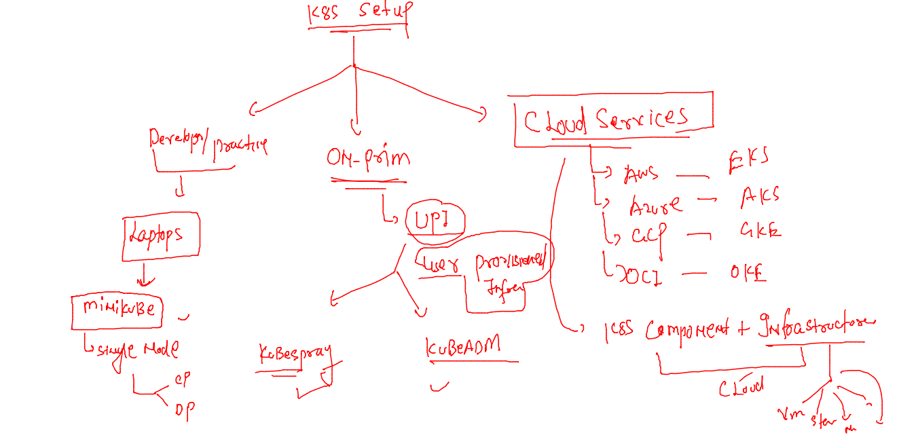
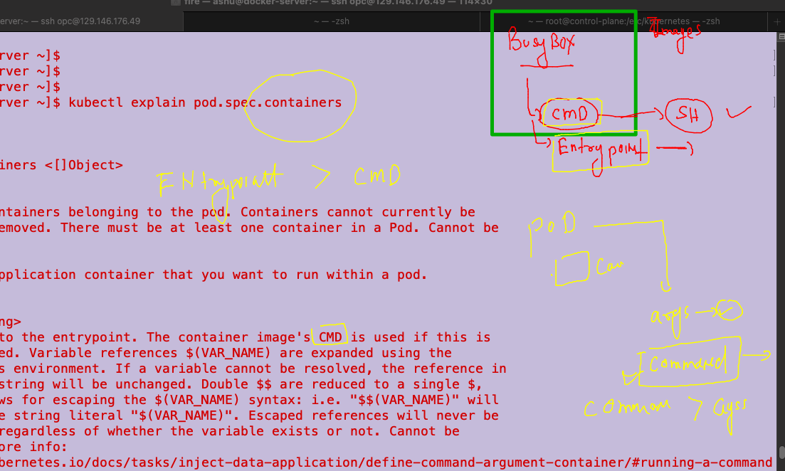
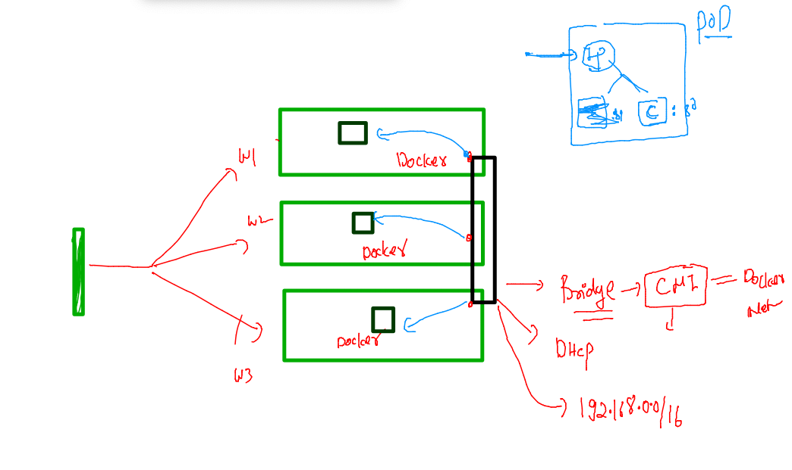
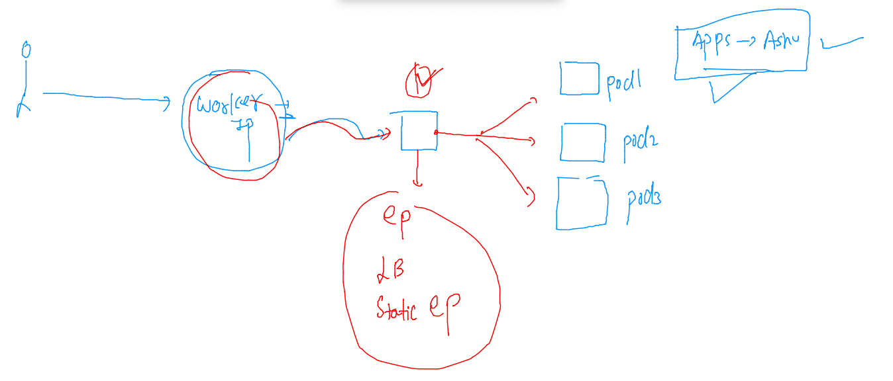
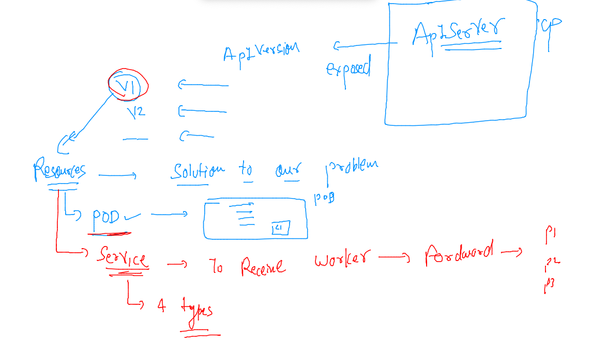
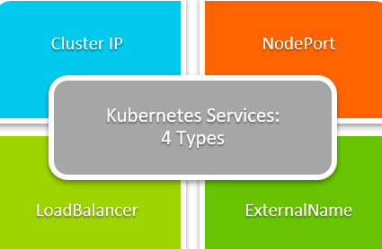

# oracle-docker-k8s1st_aug2022

### training plan 


### installing kubernetes in various platforms / Env 



### install minikube in any platform for k8s setup on local machine 

[install_link](https://minikube.sigs.k8s.io/docs/start/)

### setup 

```
[ashu@docker-server ~]$ minikube version 
minikube version: v1.26.1
commit: 62e108c3dfdec8029a890ad6d8ef96b6461426dc
[ashu@docker-server ~]$ minikube  start 
😄  minikube v1.26.1 on Oracle 7.9 (amd64)
✨  Automatically selected the docker driver
💨  For improved Docker performance, Upgrade Docker to a newer version (Minimum recommended version is 20.10.0, minimum supported version is 18.09.0, current version is 19.03.11-ol)
📌  Using Docker driver with root privileges
👍  Starting control plane node minikube in cluster minikube
🚜  Pulling base image ...
💾  Downloading Kubernetes v1.24.3 preload ...
    > preloaded-images-k8s-v18-v1...:  405.75 MiB / 405.75 MiB  100.00% 103.47 
    > gcr.io/k8s-minikube/kicbase:  386.60 MiB / 386.61 MiB  100.00% 38.45 MiB 
    > gcr.io/k8s-minikube/kicbase:  0 B [_______________________] ?% ? p/s 7.7s
🔥  Creating docker container (CPUs=2, Memory=3900MB) ...
🐳  Preparing Kubernetes v1.24.3 on Docker 20.10.17 ...
    ▪ Generating certificates and keys ...
    ▪ Booting up control plane ...
    ▪ Configuring RBAC rules ...
🔎  Verifying Kubernetes components...
    ▪ Using image gcr.io/k8s-minikube/storage-provisioner:v5
🌟  Enabled addons: storage-provisioner, default-storageclass
🏄  Done! kubectl is now configured to use "minikube" cluster and "default" namespace by default
[ashu@docker-server ~]$ 

```


### setup k8s multinode cluster using kubeadm -- 

[Vidoe_link](https://www.youtube.com/watch?v=TTzbQdu30YA&t=24s)

### auto generating YAML / JSON files for k8s resources 

### pod 

```
[ashu@docker-server ~]$ kubectl  run  ashupod1  --image=nginx --port 80 --dry-run=client -o yaml 
apiVersion: v1
kind: Pod
metadata:
  creationTimestamp: null
  labels:
    run: ashupod1
  name: ashupod1
spec:
  containers:
  - image: nginx
    name: ashupod1
    ports:
    - containerPort: 80
    resources: {}
  dnsPolicy: ClusterFirst
  restartPolicy: Always
status: {}

```

### saving yaml in a file and deploy it 

```
 kubectl  run  ashupod1  --image=nginx --port 80 --dry-run=client -o yaml  >autopod.yaml
[ashu@docker-server k8s-app-deploy]$ kubectl apply -f autopod.yaml 
pod/ashupod1 created
[ashu@docker-server k8s-app-deploy]$ kubectl get  po 
NAME       READY   STATUS              RESTARTS   AGE
ashupod1   1/1     Running             0          15s
udaypod1   0/1     ContainerCreating   0          1s
[ashu@docker-server k8s-app-deploy]$ 
```

### deleting all pods 

```
[ashu@docker-server ~]$ kubectl delete pods --all
pod "ankitpod2" deleted
pod "ashupod1" deleted
pod "namanpod1" deleted
pod "namanpodalt" deleted
pod "priyampod1" deleted

```

###  CMD & ENTRYpoint  vs args & command 




### using command from cli 

```
kubectl run x1 --image=busybox  --command ping fb.com --dry-run=client -o yaml 
apiVersion: v1
kind: Pod
metadata:
  creationTimestamp: null
  labels:
    run: x1
  name: x1
spec:
  containers:
  - command:
    - ping
    - fb.com
    image: busybox
    name: x1

```

### alternativ way 

```
apiVersion: v1
kind: Pod
metadata:
  creationTimestamp: null
  labels:
    run: ashutoshhpod1
  name: ashutoshhpod1
spec:
  containers:
  - image: busybox
    name: ashutoshhpod1
    command: ["sh","-c","ping fb.com"] # in array format 
    resources: {}
  dnsPolicy: ClusterFirst
  restartPolicy: Always
status: {}

```

### history 

```
  378  kubectl run x1 --image=busybox  --command ping fb.com --dry-run=client -o yaml 
  379  kubectl  get po 
  380  kubectl logs  ashutoshhpod1 
  381  kubectl logs  ashutoshhpod1  >logs.txt
  382  hsitor
  383  history 
  384  ls
  385  kubectl exec -it  ashutoshhpod1 -- sh 
  386  kubectl cp logs.txt ashutoshhpod1:/opt/
  387  kubectl exec -it  ashutoshhpod1 -- ls /opt
  388  kubectl get po ashutoshhpod1 -o wide
  389  kubectl exec -it ashutoshhpod1 -- sh 
  390  history 
  391  kubectl exec -it  ashutoshhpod1 --  echo hello  >>/opt/logs.txt
  392  kubectl exec -it  ashutoshhpod1 --  sh -c 'echo hello  >>/opt/logs.txt'
  393  kubectl exec -it ashutoshhpod1 -- cat /opt/logs.txt 
```

### pod networking 



### deploy docker image as webapp

```
kubectl run ashuwebapp --image=dockerashu/ashucustomer:v1   --port 80 --dry-run=client -o yaml >webapp.yaml 
```

### changes in yaml by adding enV section 

```
apiVersion: v1
kind: Pod
metadata:
  creationTimestamp: null
  labels:
    run: ashuwebapp
  name: ashuwebapp
spec:
  containers:
  - image: dockerashu/ashucustomer:v1
    name: ashuwebapp
    ports:
    - containerPort: 80
    resources: {}
    env: # for placing value of ENV variable
    - name: deploy # name of env in Docker image 
      value: webapp2 # value to deploy app 2 
  dnsPolicy: ClusterFirst
  restartPolicy: Always
status: {}

====
[ashu@docker-server k8s-app-deploy]$ kubectl apply -f  webapp.yaml 
pod/ashuwebapp created
[ashu@docker-server k8s-app-deploy]$ kubectl  get po 
NAME             READY   STATUS    RESTARTS   AGE
ashuwebapp       1/1     Running   0          25s
```

### to access app runnng inside k8s we need below given resoures 



### service and understanding and its types


====


