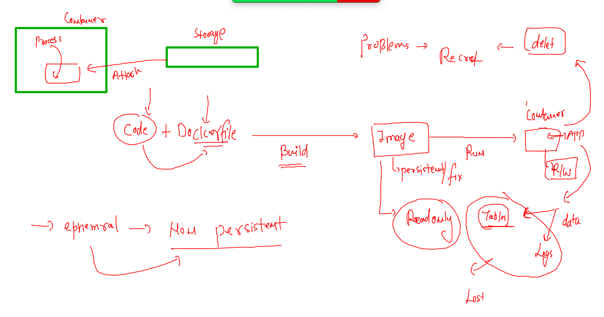
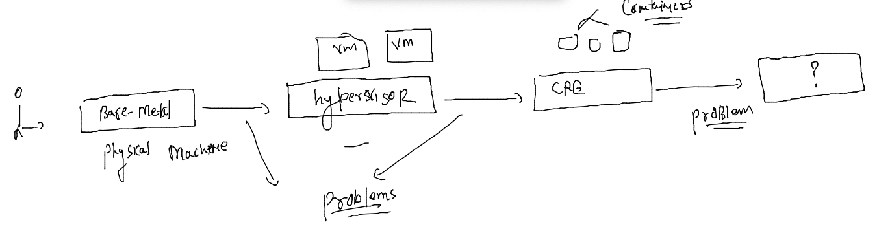
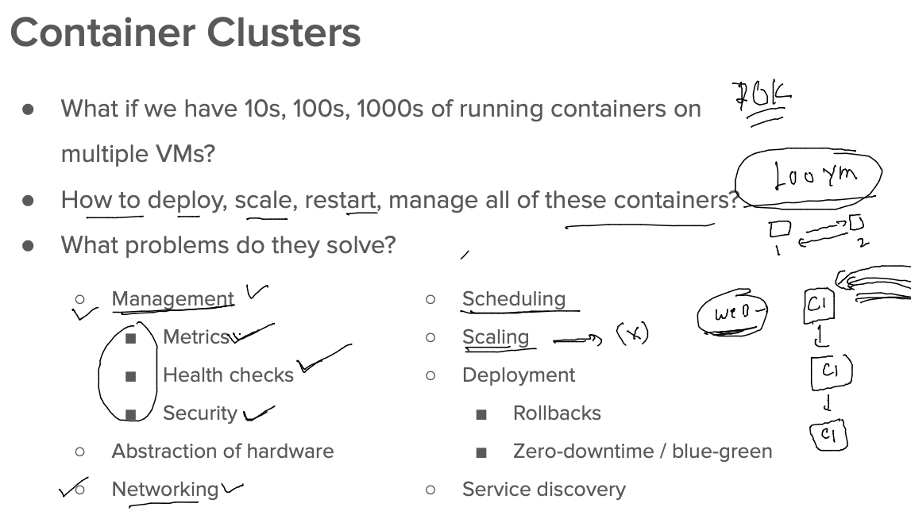
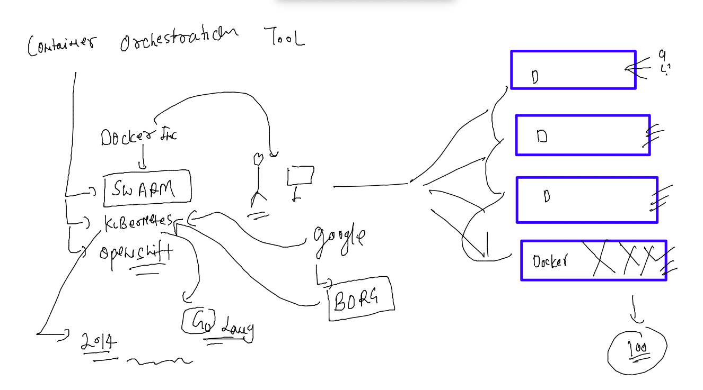
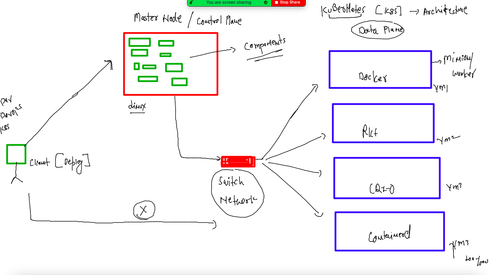
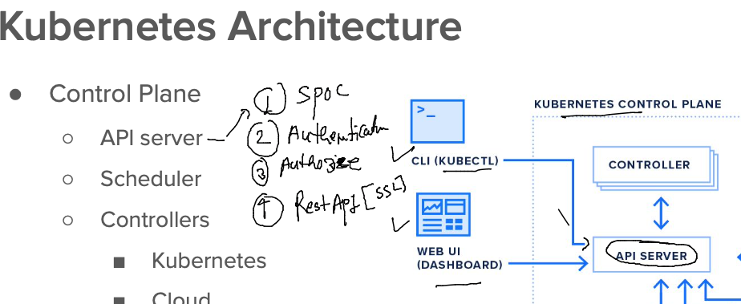
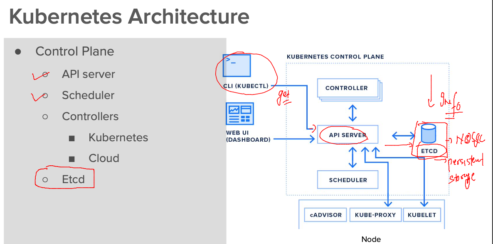
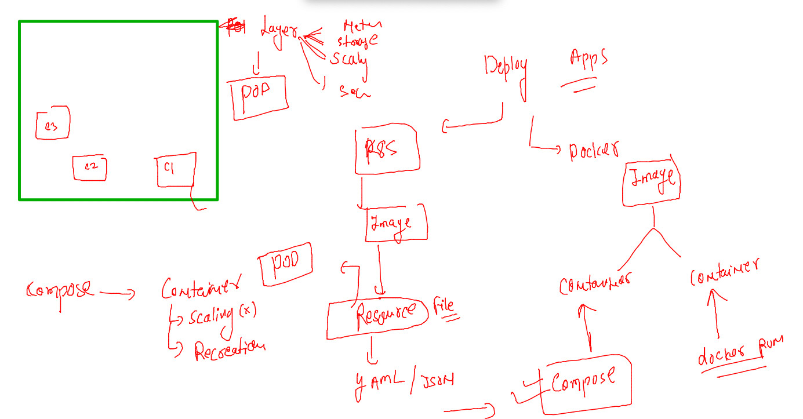

# oracle-docker-k8s1st_aug2022

### training plan 


### Some info about webservers 


### cloning java webapp

```
git clone  https://github.com/redashu/javawebapp.git


```

### adding compose file in javawebapp folder

```

version: '3.8'
services:
  ashujavaapp1:
    image: ashujavaweb:v1 
    build: . 
    container_name: ashuc111
    restart: always 
    ports:
    - "1234:8080"

```

### lets run it 

```
[ashu@docker-server javawebapp]$ ls
docker-compose.yaml  Dockerfile  myapp  README.md
[ashu@docker-server javawebapp]$ docker-compose up -d 
[+] Running 0/1
 ⠧ ashujavaapp1 Pulling                                                                      0.7s
[+] Building 21.5s (10/10) FINISHED                                                               
 => [internal] load build definition from Dockerfile                                         0.0s
 => => transferring doc
```

## Storage 



### docker volumes


### creating volume 

```
[root@docker-server Nodejs]# docker  volume  ls
DRIVER              VOLUME NAME
[root@docker-server Nodejs]# docker  volume  create  ashuvol1
ashuvol1
[root@docker-server Nodejs]# docker  volume  ls
DRIVER              VOLUME NAME
local               ashuvol1
[root@docker-server Nodejs]# docker  volume  inspect ashuvol1 
[
    {
        "CreatedAt": "2022-08-03T05:26:35Z",
        "Driver": "local",
        "Labels": {},
        "Mountpoint": "/var/lib/docker/volumes/ashuvol1/_data",
        "Name": "ashuvol1",
        "Options": {},
        "Scope": "local"
    }
]

```

### creating mysql container 

```
[root@docker-server Nodejs]# docker run -d  --name  ashudbc1  -e  MYSQL_ROOT_PASSWORD="Oracle@123"  -v  ashuvol1:/var/lib/mysql/ mysql 
Unable to find image 'mysql:latest' locally
Trying to pull repository docker.io/library/mysql ... 
latest: Pulling from docker.io/library/mysql
e54b73e95ef3: Pull complete 
327840d38cb2: Pull complete 
642077275f5f: Pull complete 
e077469d560d: Pull complete 
cbf214d981a6: Pull complete 
f4fda5f8b9a8: Pull complete 
a41c2763043b: Pull complete 
f86b3df6abb1: Pull complete 
95b1c2ed2ecf: Pull complete 
b0edcd52771b: Pull complete 
a3d312b5c835: Pull complete 
Digest: sha256:657d78ee56e09101902673adcdd7d2bf03012e759c1aa525eeca28cb0fe1aa7d
Status: Downloaded newer image for mysql:latest
15cfe7e9c510803627acb025d802654536fa5e95d566fa752d21d36bfcb53ffb
[root@docker-server Nodejs]# docker  ps
CONTAINER ID        IMAGE               COMMAND                  CREATED             STATUS              PORTS                 NAMES
15cfe7e9c510        mysql               "docker-entrypoint.s…"   14 seconds ago      Up 6 seconds        3306/tcp, 33060/tcp   ashudbc1
[root@docker-server Nodejs]# 

```

### login into container and creating database 

```
[root@docker-server Nodejs]# docker  exec -it  ashudbc1   bash 
bash-4.4# 

bash-4.4# 
bash-4.4# mysql -u root -p
Enter password: 
Welcome to the MySQL monitor.  Commands end with ; or \g.
Your MySQL connection id is 8
Server version: 8.0.30 MySQL Community Server - GPL

Copyright (c) 2000, 2022, Oracle and/or its affiliates.

Oracle is a registered trademark of Oracle Corporation and/or its
affiliates. Other names may be trademarks of their respective
owners.

Type 'help;' or '\h' for help. Type '\c' to clear the current input statement.

mysql> show databases;
+--------------------+
| Database           |
+--------------------+
| information_schema |
| mysql              |
| performance_schema |
| sys                |
+--------------------+
4 rows in set (0.00 sec)

mysql> create database info ;
Query OK, 1 row affected (0.01 sec)

mysql> create database codestatus ;
Query OK, 1 row affected (0.00 sec)


mysql> show databases;
+--------------------+
| Database           |
+--------------------+
| codestatus         |
| info               |
| information_schema |
| mysql              |
| performance_schema |
| sys                |
+--------------------+
6 rows in set (0.00 sec)

mysql> ^DBye
bash-4.4# exit

```

### compose file for MYSQL and Postgres 

```
version:  '3.8'
volumes: # creating volume 
  ashudbvol111: # name of volume 
  ashudbvol222: # creating another volume 
services:
  ashudbmysql1: # mysql db 
    image: mysql
    container_name: ashudbc2
    restart: always 
    volumes:
    - "ashudbvol222:/var/lib/mysql/"
    environment: 
      MYSQL_ROOT_PASSWORD: "Oracle@123"
  ashudbapp1: # postgres DB 
    image: postgres
    container_name: ashudbc1
    volumes:
    - "ashudbvol111:/var/lib/postgresql/data/"
    restart: always 
    environment:
      POSTGRES_PASSWORD: "Oracle@123"
```


### lets run it 

```
[ashu@docker-server ashu-compose]$ docker-compose -f postgres.yaml up -d
[+] Running 5/5
 ⠿ Network ashu-compose_default        Created                                               0.1s
 ⠿ Volume "ashu-compose_ashudbvol222"  Created                                               0.0s
 ⠿ Volume "ashu-compose_ashudbvol111"  Created                                               0.0s
 ⠿ Container ashudbc1                  Started                                               0.9s
 ⠿ Container ashudbc2                  Started                                               0.7s
[ashu@docker-server ashu-compose]$ docker-compose -f postgres.yaml ps
NAME                COMMAND                  SERVICE             STATUS              PORTS
ashudbc1            "docker-entrypoint.s…"   ashudbapp1          running             5432/tcp
ashudbc2            "docker-entrypoint.s…"   ashudbmysql1        running             3306/tcp, 33060/tcp
```

### more docker volume cases 

```
[root@docker-server ~]# docker volume  create ashuvol1 
ashuvol1
[root@docker-server ~]# docker volume  create ashuvol2
ashuvol2
[root@docker-server ~]# 
[root@docker-server ~]# docker  run -dit  --name c1  -v ashuvol1:/mnt/d1:rw   alpine 
69f61107553148e119572acd01b6244cf9d430028f9ee128b7e6878a332fae3b
[root@docker-server ~]# 
[root@docker-server ~]# 
[root@docker-server ~]# docker  ps
CONTAINER ID        IMAGE               COMMAND             CREATED             STATUS              PORTS               NAMES
69f611075531        alpine              "/bin/sh"           4 seconds ago       Up 3 seconds                            c1
[root@docker-server ~]# 
[root@docker-server ~]# 
[root@docker-server ~]# 
[root@docker-server ~]# docker  run -dit  --name c2  -v ashuvol1:/mnt/d1:rw  -v ashuvol2:/mnt/d2:ro    alpine 
17660a32b226df39250dc8190069581dc5c9954cb707ce8e394fa7a493629057
[root@docker-server ~]# docker  ps
CONTAINER ID        IMAGE               COMMAND             CREATED             STATUS              PORTS               NAMES
17660a32b226        alpine              "/bin/sh"           3 seconds ago       Up 2 seconds                            c2
69f611075531        alpine              "/bin/sh"           37 seconds ago      Up 35 seconds                           c1


[root@docker-server ~]# docker  exec -it c2  sh 
/ # cd /mnt/
/mnt # ls
d1  d2
/mnt # mkdir d1/helllo
/mnt # mkdir d2/helllo
mkdir: can't create directory 'd2/helllo': Read-only file system
/mnt # exit

```

### using host directory to use a volume 

```
 287  cd /mnt/
  288  ls
  289  git clone https://github.com/microsoft/project-html-website.git
  290  ls
  291  cd project-html-website/
  292  ls
  293  pwd
  294  docker run -d  --name cc11 -v /mnt/project-html-website:/usr/share/nginx/html/:ro -p 1234:80 nginx 
  295  ls

```

### webUI for docker host using portainer 

```

[root@docker-server ~]# docker  run -d --name webui --restart always -p 1101:9000 -v /var/run/docker.sock:/var/run/docker.sock portainer/portainer 
Unable to find image 'portainer/portainer:latest' locally
Trying to pull repository docker.io/portainer/portainer ... 
latest: Pulling from docker.io/portainer/portai
```

### Understanding problems with container Runtime 



### problems with containers 



### intro about k8s 



### hardware  / vm level infra



### control plane -- api-server



### install kubectl -- which is k8s client 

```
[root@docker-server ~]# curl -LO "https://dl.k8s.io/release/$(curl -L -s https://dl.k8s.io/release/stable.txt)/bin/linux/amd64/kubectl"
  % Total    % Received % Xferd  Average Speed   Time    Time     Time  Current
                                 Dload  Upload   Total   Spent    Left  Speed
100   154  100   154    0     0    823      0 --:--:-- --:--:-- --:--:--   827
100 43.5M  100 43.5M    0     0  84.5M      0 --:--:-- --:--:-- --:--:-- 84.5M
[root@docker-server ~]# ls
Nodejs  kubectl
[root@docker-server ~]# mv kubectl /usr/bin/
[root@docker-server ~]# chmod +x /usr/bin/kubectl 
[root@docker-server ~]# 
[root@docker-server ~]# kubectl version --client 
WARNING: This version information is deprecated and will be replaced with the output from kubectl version --short.  Use --output=yaml|json to get the full version.
Client Version: version.Info{Major:"1", Minor:"24", GitVersion:"v1.24.3", GitCommit:"aef86a93758dc3cb2c658dd9657ab4ad4afc21cb", GitTreeState:"clean", BuildDate:"2022-07-13T14:30:46Z", GoVersion:"go1.18.3", Compiler:"gc", Platform:"linux/amd64"}
Kustomize Version: v4.5.4
[root@docker-server ~]# kubectl version --client  -o yaml 
clientVersion:
  buildDate: "2022-07-13T14:30:46Z"
  compiler: gc
  gitCommit: aef86a93758dc3cb2c658dd9657ab4ad4afc21cb
  gitTreeState: clean
  gitVersion: v1.24.3
  goVersion: go1.18.3
  major: "1"
  minor: "24"
  platform: linux/amd64
kustomizeVersion: v4.5.4

```

### sending first request to kube-apiserver -- using kubectl 

```
[ashu@docker-server k8s-app-deploy]$ kubectl  get  nodes --kubeconfig admin.conf 
NAME            STATUS   ROLES           AGE     VERSION
control-plane   Ready    control-plane   7d23h   v1.24.3
workernode1     Ready    <none>          7d23h   v1.24.3
workernode2     Ready    <none>          7d23h   v1.24.3
```

### copy admin.conf to the right location 

```
[ashu@docker-server k8s-app-deploy]$ kubectl  cluster-info  --kubeconfig admin.conf 
Kubernetes control plane is running at https://44.207.217.46:6443
CoreDNS is running at https://44.207.217.46:6443/api/v1/namespaces/kube-system/services/kube-dns:dns/proxy

To further debug and diagnose cluster problems, use 'kubectl cluster-info dump'.
[ashu@docker-server k8s-app-deploy]$ mkdir  ~/.kube 
mkdir: cannot create directory ‘/home/ashu/.kube’: File exists
[ashu@docker-server k8s-app-deploy]$ 
[ashu@docker-server k8s-app-deploy]$ cp -v admin.conf   ~/.kube/config  
‘admin.conf’ -> ‘/home/ashu/.kube/config’
[ashu@docker-server k8s-app-deploy]$ 
[ashu@docker-server k8s-app-deploy]$ kubectl  get  nodes
NAME            STATUS   ROLES           AGE     VERSION
control-plane   Ready    control-plane   7d23h   v1.24.3
workernode1     Ready    <none>          7d23h   v1.24.3
workernode2     Ready    <none>          7d23h   v1.24.3
```

### etcd 



### introduction to Pod 



### FIRst YAML POD resource file 

```
apiVersion: v1 # apiVersion 
kind: Pod # resource type 
metadata: # info about resource 
  name: ashupod-123 # name of pod 
spec: # info about application 
  containers: # info about container 
  - image: nginx
    name: ashuc1
    ports:
    - containerPort: 80 
```

### test syntax 

```
[ashu@docker-server k8s-app-deploy]$ ls
ashupod1.yaml
[ashu@docker-server k8s-app-deploy]$ kubectl apply -f  ashupod1.yaml --dry-run=client 
pod/ashupod-123 created (dry run)
[ashu@docker-server k8s-app-deploy]$ 


```

### Sending request to create pods 

```
[ashu@docker-server k8s-app-deploy]$ kubectl apply -f  ashupod1.yaml 
pod/ashupod-123 created
[ashu@docker-server k8s-app-deploy]$ kubectl   get  pods 
NAME              READY   STATUS    RESTARTS   AGE
ashupod-123       1/1     Running   0          13s
priyankapod-123   1/1     Running   0          7s
sureshpod1        1/1     Running   0          94s
[ashu@docker-server k8s-app-deploy]$ 

```

###

```
[ashu@docker-server k8s-app-deploy]$ kubectl   get  pods  -o wide
NAME              READY   STATUS    RESTARTS   AGE     IP                NODE          NOMINATED NODE   READINESS GATES
ashupod-123       1/1     Running   0          57s     192.168.212.31    workernode1   <none>           <none>
priyankapod-123   1/1     Running   0          51s     192.168.216.113   workernode2   <none>           <none>
sureshpod1        1/1     Running   0          2m18s   192.168.212.19    workernode1   <none>           <none>
[ashu@docker-server k8s-app-deploy]$ 

```

### checking logs fo pods 

```
[ashu@docker-server ~]$ kubectl  logs ashupod-123
/docker-entrypoint.sh: /docker-entrypoint.d/ is not empty, will attempt to perform configuration
/docker-entrypoint.sh: Looking for shell scripts in /docker-entrypoint.d/
/docker-entrypoint.sh: Launching /docker-entrypoint.d/10-listen-on-ipv6-by-default.sh
10-listen-on-ipv6-by-default.sh: info: Getting the checksum of /etc/nginx/conf.d/default.conf
10-listen-on-ipv6-by-default.sh: info: Enabled listen on IPv6 in /etc/nginx/conf.d/default.conf
/docker-entrypoint.sh: Launching /docker-entrypoint.d/20-envsubst-on-templates.sh
/docker-entrypoint.sh: Launching /docker-entrypoint.d/30-tune-worker-processes.sh
/docker-entrypoint.sh: Configuration complete; ready for start up
2022/08/03 11:13:43 [notice] 1#1: using the "epoll" event method
2022/08/03 11:13:43 [notice] 1#1: nginx/1.23.1
2022/08/03 11:13:43 [notice] 1#1: built by gcc 10.2.1 20210110 (Debian 10.2.1-6) 
2022/08/03 11:13:43 [notice] 1#1: OS: Linux 5.10.118-111.515.amzn2.x86_64
2022/08/03 11:13:43 [notice] 1#1: getrlimit
```

### using describe pod 

```
[ashu@docker-server ~]$ kubectl  describe pod ashupod-123
Name:         ashupod-123
Namespace:    default
Priority:     0
Node:         workernode1/172.31.88.154
Start Time:   Wed, 03 Aug 2022 11:13:42 +0000
Labels:       <none>
Annotations:  cni.projectcalico.org/containerID: 41edfeb54f1bb30edb1b6515e315fd34df36d79a275e898cee95d5b8f56007b7
              cni.projectcalico.org/podIP: 192.168.212.31/32
              cni.projectcalico.org/podIPs: 192.168.212.31/32
Status:       Running
IP:           192.168.212.31
IPs:
  IP:  192.168.212.31
Containers:

```

### access container inside pod 

```
[ashu@docker-server ~]$ kubectl   exec -it  ashupod-123   -- sh 
# 
# cat  /etc/os-release 
PRETTY_NAME="Debian GNU/Linux 11 (bullseye)"
NAME="Debian GNU/Linux"
VERSION_ID="11"
VERSION="11 (bullseye)"
VERSION_CODENAME=bullseye
ID=debian
HOME_URL="https://www.debian.org/"
SUPPORT_URL="https://www.debian.org/support"
BUG_REPORT_URL="https://bugs.debian.org/"
# ls
bin   dev		   docker-entrypoint.sh  home  lib64  mnt  proc  run   srv  tmp  var
boot  docker-entrypoint.d  etc			 lib   media  opt  root  sbin  sys  usr
# exit

```

### deleting pods 

```
[ashu@docker-server ~]$ kubectl delete pod ashupod-123
pod "ashupod-123" deleted
```
