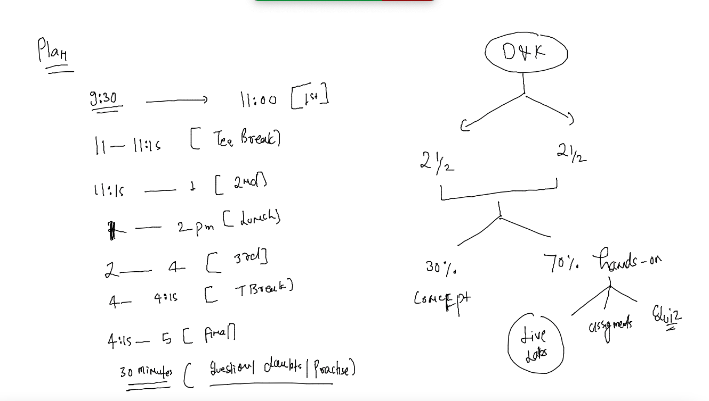
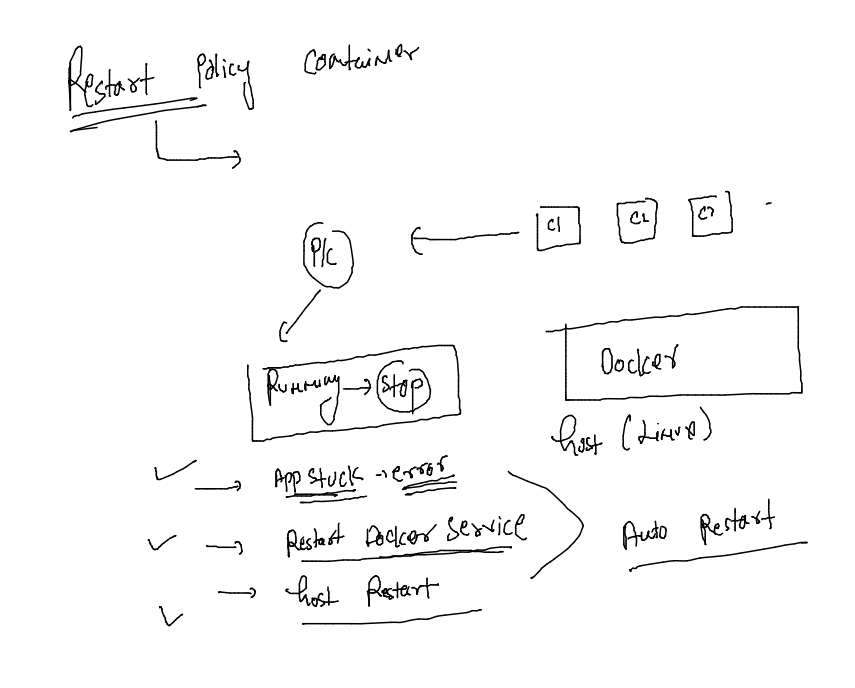
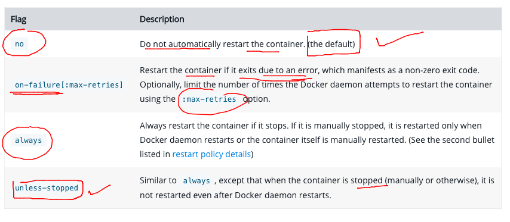
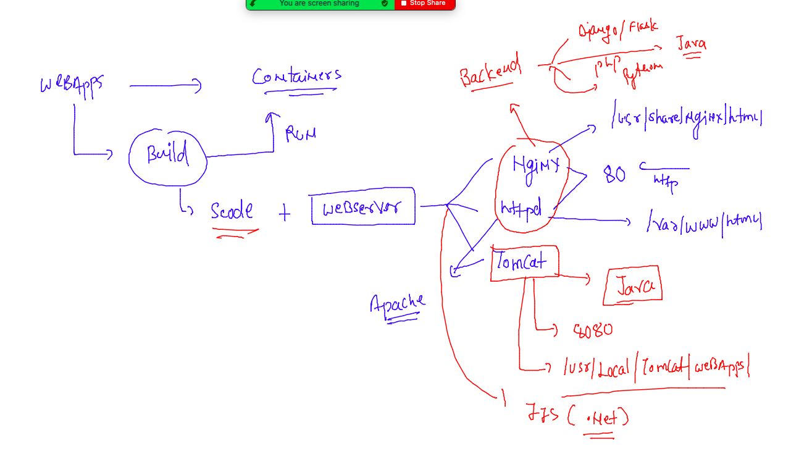
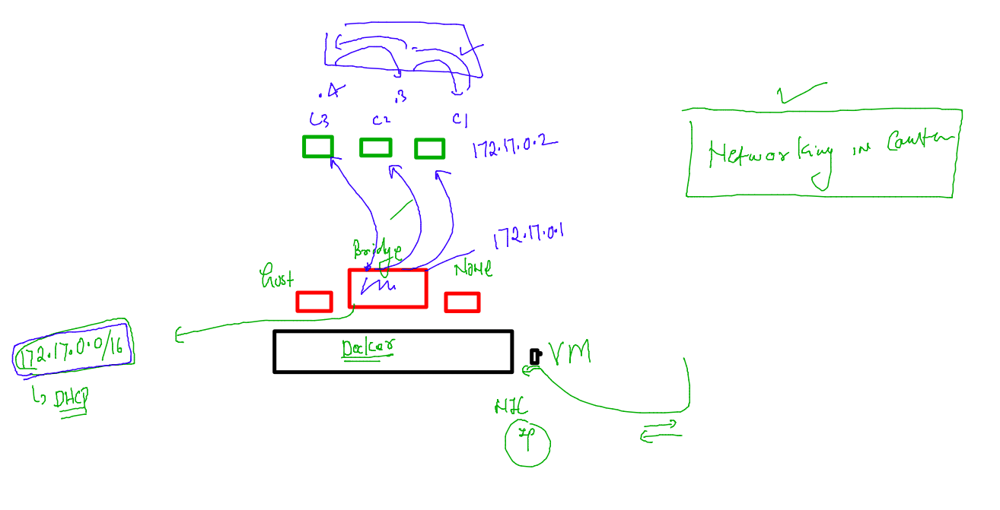
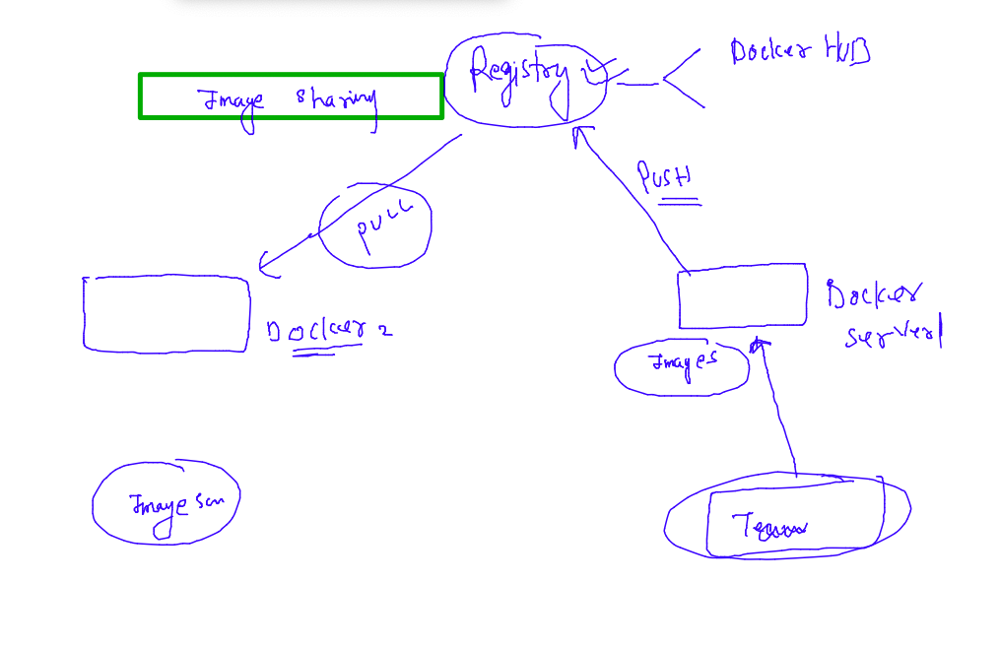

# oracle-docker-k8s1st_aug2022

### training plan 



### restart container policy 



### list of restart policies 



### checking restart policy of containers 

```
[ashu@docker-server ~]$ docker  inspect  test5 --format='{{.Id}}'
3c1f681aa0579df7f2d7e4f3a4b72da3c45be70d5b8c9915f7c163be1cd3be1a
[ashu@docker-server ~]$ docker  inspect  test5 --format='{{.State.Status}}'
exited
[ashu@docker-server ~]$ 
[ashu@docker-server ~]$ docker  inspect  test5 --format='{{.HostConfig.RestartPolicy.Name}}'
no
[ashu@docker-server ~]$ docker  inspect  test4  --format='{{.HostConfig.RestartPolicy.Name}}'
no
[ashu@docker-server ~]$ docker  ps
CONTAINER ID        IMAGE               COMMAND                  CREATED             STATUS              PORTS               NAMES
bb7ce5371354        alpine:sureshk      "/bin/sh -c 'python3…"   44 minutes ago      Up 44 minutes                           alpinex
[ashu@docker-server ~]$ docker  inspect  alpinex   --format='{{.HostConfig.RestartPolicy.Name}}'
no

```

### setting the restart policy during container creation time 

```
[ashu@docker-server ~]$ docker run -d  --name ashuc1 --restart always  alpine  ping fb.com 
bb6740b54fb36deac3f088a1b68d9eb4176b2c5bc400b2bf69f1295bdc4e2389
[ashu@docker-server ~]$ 
[ashu@docker-server ~]$ docker  ps
CONTAINER ID        IMAGE               COMMAND                  CREATED             STATUS              PORTS               NAMES
bb6740b54fb3        alpine              "ping fb.com"            5 seconds ago       Up 4 seconds                            ashuc1
bb7ce5371354        alpine:sureshk      "/bin/sh -c 'python3…"   45 minutes ago      Up 45 minutes                           alpinex
[ashu@docker-server ~]$ docker  inspect  ashuc1   --format='{{.HostConfig.RestartPolicy.Name}}'
always

```

### BUild sample java code to docker image 

### code 

```

class myclass { 
    public static void main(String args[]) 
    { 
        // test expression 
        while (true) { 
            System.out.println("Hello World welcome to containers ! "); 
  
            // update expression 
        } 
    } 
} 
```

### Dockerfile 

```
FROM openjdk
LABEL name=ashutoshh
RUN mkdir /mycode 
COPY test.java /mycode/
WORKDIR /mycode
RUN javac test.java 
# to compile java code 
CMD [ "java","myclass" ]


```

### lets build it 

```
[ashu@docker-server docker-images]$ ls
javacode  nodecode  pythoncodes
[ashu@docker-server docker-images]$ cd  javacode/
[ashu@docker-server javacode]$ ls
Dockerfile  test.java
[ashu@docker-server javacode]$ docker  build -t  ashujavacode:v1 . 
Sending build context to Docker daemon  3.072kB
Step 1/7 : FROM openjdk
 ---> 04bf630c9556
Step 2/7 : LABEL name=ashutoshh
 ---> Running in c456d6d20c68
Removing intermediate container c456d6d20c68
 ---> a18246c07ce2
Step 3/7 : RUN mkdir /mycode
 ---> Running in 638d29fcbbc9
Removing intermediate container 638d29fcbbc9
 ---> 5264baea515e
Step 4/7 : COPY test.java /mycode/
 ---> 2c7cb82bbad3
Step 5/7 : WORKDIR /mycode
 ---> Running in 2099f89df1c0
Removing intermediate container 2099f89df1c0
 ---> b52face723e1
Step 6/7 : RUN javac test.java
 ---> Running in 66715fbe7d4c
Removing intermediate container 66715fbe7d4c
 ---> 3e1dc9946d35
Step 7/7 : CMD [ "java","myclass" ]
 ---> Running in ad0797d8fa3d
Removing intermediate container ad0797d8fa3d
 ---> 153e6c357172
Successfully built 153e6c357172
Successfully tagged ashujavacode:v1

```

### lets create container 

```
[root@docker-server ~]# docker images  |   grep -i ashu
ashujavacode        v1                  153e6c357172        About a minute ago   464MB
python              ashucodev4          9b40bc78f123        18 hours ago         438MB
python              ashucodev3          40300cfc3d1a        18 hours ago         438MB
python              ashucodev2          a794deeb7a21        18 hours ago         438MB
ashualp             pycodev1            95fa69ce0e87        19 hours ago         55.8MB
python              ashucodev1          99caa1a336e5        19 hours ago         920MB
[root@docker-server ~]# 
[root@docker-server ~]# docker run -itd --name ashut1  ashujavacode:v1  
805ce0b7001111de9635432db6e0a1974197200669afb2cc6687a78ea7b5f696
[root@docker-server ~]# docker  ps
CONTAINER ID        IMAGE               COMMAND             CREATED             STATUS              PORTS               NAMES
805ce0b70011        ashujavacode:v1     "java myclass"      2 seconds ago       Up 2 seconds                            ashut1
61fd4822302e        suresh:myjava       "java Test"         2 minutes ago       Up 2 minutes                            SureshJava
[root@docker-server ~]# docker logs  ashut1 

```

### checking jdk version 

```
[root@docker-server ~]# docker  exec -it  ashut1  bash 
bash-4.4# 
bash-4.4# java -version 
openjdk version "18.0.2" 2022-07-19
OpenJDK Runtime Environment (build 18.0.2+9-61)
OpenJDK 64-Bit Server VM (build 18.0.2+9-61, mixed mode, sharing)
bash-4.4# exit
[root@docker-server ~]# 


```

### webapp in containers 

### webservers



### clone sample app code 

```
ashu@docker-server docker-images]$ mkdir webapps
[ashu@docker-server docker-images]$ cd webapps/
[ashu@docker-server webapps]$ git clone https://github.com/microsoft/project-html-website.git
Cloning into 'project-html-website'...
remote: Enumerating objects: 19, done.
remote: Total 19 (delta 0), reused 0 (delta 0), pack-reused 19
Unpacking objects: 100% (19/19), done.
[ashu@docker-server webapps]$ ls
project-html-website
[ashu@docker-server webapps]$ 

```

### build 

## Dockerfile 

```
FROM nginx
LABEL email="ashutoshh@linux.com"
COPY project-html-website /usr/share/nginx/html/
# Note we if we are not using CMD / ENtrypoint then From image default cmd/entrypoint will 
# be considered 

```

###

```
[ashu@docker-server webapps]$ ls
Dockerfile  project-html-website
[ashu@docker-server webapps]$ docker build  -t  ashuwebapp:v1  . 
Sending build context to Docker daemon  1.405MB
Step 1/3 : FROM nginx
Trying to pull repository docker.io/library/nginx ... 
latest: Pulling from docker.io/library/nginx
461246efe0a7: Pull complete 
060bfa6be22e: Pull complete 
b34d5ba6fa9e: Pull complete 
8128ac56c745: Pull complete 
44d36245a8c9: Pull complete 
ebcc2cc821e6: Pull complete 
Digest: sha256:cf4eeae444277ad9f02df9c63afc60646fd9259784f729f4c3990cd957e5a6e5
Status: Downloaded newer image for nginx:latest
 ---> 670dcc86b69d
Step 2/3 : LABEL email="ashutoshh@linux.com"
 ---> Running in e0a26341fc5f
Removing intermediate container e0a26341fc5f
 ---> e9009d420917
Step 3/3 : COPY project-html-website /usr/share/nginx/html/
 ---> 07e1d52e636c
Successfully built 07e1d52e636c
Successfully tagged ashuwebapp:v1
```

### docker networking 



##

```
[root@docker-server ~]# docker  network  ls
NETWORK ID          NAME                DRIVER              SCOPE
9fb9ad1fc1c7        bridge              bridge              local
f9f782054aa6        host                host                local
6fb3392045ca        none                null                local
[root@docker-server ~]# docker  network inspect bridge 
[
    {
        "Name": "bridge",
        "Id": "9fb9ad1fc1c788cec4a5e76fc9b3a5e1557819fae8fa9ea3f66a691aec1173ba",
        "Created": "2022-08-02T04:48:38.936631213Z",
        "Scope": "local",
        "Driver": "bridge",
        "EnableIPv6": false,
        "IPAM": {
            "Driver": "default",
            "Options": null,
            "Config": [
                {
                    "Subnet": "172.17.0.0/16",
                    "Gateway": "172.17.0.1"
                }
            ]

```

### creating container with port forwarding option

```
[root@docker-server ~]# docker  images  |   grep ashu
ashuwebapp          v1                  07e1d52e636c        31 minutes ago      143MB
[root@docker-server ~]# docker  run -d  --name ashuwc1  -p  1234:80  ashuwebapp:v1 
7e9a78b74c2b15db624ab6973c3eabb8555fdfe5ff7dd5c6ef3947387eaa838b
[root@docker-server ~]# docker  ps
CONTAINER ID        IMAGE               COMMAND                  CREATED             STATUS              PORTS                            NAMES
7e9a78b74c2b        ashuwebapp:v1       "/docker-entrypoint.…"   3 seconds ago       Up 3 seconds        0.0.0.0:1234->80/tcp             ashuwc1

```

### Image sharing using Docker hUb registry 



## pushing image to docker hub 

### tagging 

```
[root@docker-server ~]# docker  images  |   grep ashu
ashuwebapp          v1                  07e1d52e636c        About an hour ago   143MB
[root@docker-server ~]# 
[root@docker-server ~]# 
[root@docker-server ~]# docker  tag   ashuwebapp:v1  docker.io/dockerashu/ashuwebapp:v1  
[root@docker-server ~]# 
[root@docker-server ~]# docker  images  |   grep ashu
dockerashu/ashuwebapp   v1                  07e1d52e636c        About an hour ago   143MB
ashuwebapp              v1                  07e1d52e636c        About an hour ago   143MB
[root@docker-server ~]# 


```

### login for authorization 

```
[root@docker-server ~]# docker login  
Login with your Docker ID to push and pull images from Docker Hub. If you don't have a Docker ID, head over to https://hub.docker.com to create one.
Username: dockerashu
Password: 
WARNING! Your password will be stored unencrypted in /root/.docker/config.json.
Configure a credential helper to remove this warning. See
https://docs.docker.com/engine/reference/commandline/login/#credentials-store

Login Succeeded

```
### pushing 

```
[root@docker-server ~]# docker  push  docker.io/dockerashu/ashuwebapp:v1
The push refers to repository [docker.io/dockerashu/ashuwebapp]
2a027000aabd: Pushed 
abc66ad258e9: Layer already exists 
243243243ee2: Layer already exists 
f931b78377da: Layer already exists 

```

### logout 

```
[root@docker-server ~]# docker logout 
Removing login credentials for https://index.docker.io/v1/
[root@docker-server ~]# 

```


