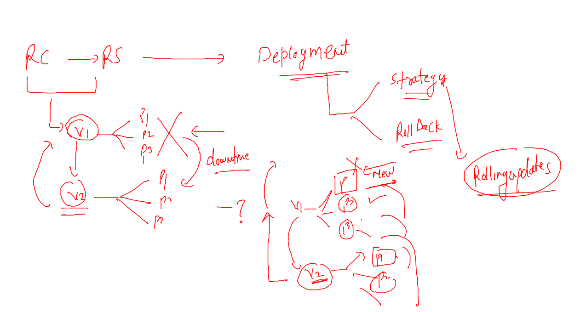

# oracle-docker-k8s1st_aug2022

### training plan 


### Deploying image from private registry to k8s cluster 


### pushing image to OCR 

```
docker  tag  8de07b3f502d  phx.ocir.io/axmbtg8judkl/customerapp:1.0 

====
[ashu@docker-server ~]$ docker login  phx.ocir.io
Username: axmbtg8judkl/learntechbyme@gmail.com
Password: 
WARNING! Your password will be stored unencrypted in /home/ashu/.docker/config.json.
Configure a credential helper to remove this warning. See
https://docs.docker.com/engine/reference/commandline/login/#credentials-store

Login Succeeded

====
[ashu@docker-server ~]$ docker push phx.ocir.io/axmbtg8judkl/customerapp:1.0 
The push refers to repository [phx.ocir.io/axmbtg8judkl/customerapp]
e8ce32bc4836: Pushed 
5f70bf18a086: Pushed 
10ef8be505c9: Pushed 
ec1bb8d2aa1b: Pushed 
38ec5019094e: Pushed 

```

### creating RC yaml 

```
apiVersion: v1
kind: ReplicationController
metadata:
  name: ashu-rc-2
spec:
  replicas: 1 # number of pod
  template:  # will use template to create pods 
    metadata:
      labels:
        run: ashuwebapp
    spec:
      containers:
      - image: phx.ocir.io/axmbtg8judkl/customerapp:1.0
        name: ashuwebappc1 
        ports:
        - containerPort: 80
        resources: {}
        env: # for placing value of ENV variable
        - name: app_deploy # name of env in Docker image 
          value: app1 # value to deploy app 1
```

### lets depoy IT 

```
[ashu@docker-server k8s-app-deploy]$ kubectl create  -f  ocr-rc.yaml 
replicationcontroller/ashu-rc-2 created
[ashu@docker-server k8s-app-deploy]$ kubectl  get  rc 
NAME        DESIRED   CURRENT   READY   AGE
ashu-rc-2   1         1         0       8s
[ashu@docker-server k8s-app-deploy]$ kubectl  get  po
NAME              READY   STATUS         RESTARTS   AGE
ashu-rc-2-78vwp   0/1     ErrImagePull   0          29s
[ashu@docker-server k8s-app-deploy]$
```
### for troubleshooting purpose you can use below command 

```
[ashu@docker-server ~]$ kubectl  get events --field-selector  type!=Normal
LAST SEEN   TYPE      REASON   OBJECT                MESSAGE
5m1s        Warning   Failed   pod/ashu-rc-2-78vwp   Failed to pull image "phx.ocir.io/axmbtg8judkl/customerapp:1.0": rpc error: code = Unknown desc = failed to pull and unpack image "phx.ocir.io/axmbtg8judkl/customerapp:1.0": failed to resolve reference "phx.ocir.io/axmbtg8judkl/customerapp:1.0": pulling from host phx.ocir.io failed with status code [manifests 1.0]: 403 Forbidden
5m1s        Warning   Failed   pod/ashu-rc-2-78vwp   Error: ErrImagePull
5m14s       Warning   Failed   pod/ashu-rc-2-78vwp   Error: ImagePullBackOff
[ashu@docker-server ~]$ 

```

### intro to secret 


### creating secret --

```
kubectl create secret  docker-registry  ashuimg-secret  --docker-server=phx.ocir.io  --docker-username="adkl/lme@gmail.com"  --docker-password="}nBO{sR"  --dry-run=client -o yaml  >secret.yaml 

```

### creating it

```
[ashu@docker-server k8s-app-deploy]$ kubectl create -f secret.yaml 
secret/ashuimg-secret created
[ashu@docker-server k8s-app-deploy]$ kubectl  get  secret 
NAME             TYPE                             DATA   AGE
ashuimg-secret   kubernetes.io/dockerconfigjson   1      5s
[ashu@docker-server k8s-app-deploy]$ 

```

### lets change yaml and redeploy it 

```
apiVersion: v1
kind: ReplicationController
metadata:
  name: ashu-rc-2
spec:
  replicas: 1 # number of pod
  template:  # will use template to create pods 
    metadata:
      labels:
        run: ashuwebapp
    spec:
      imagePullSecrets: # calling secret in YAML file 
      - name: ashuimg-secret 
      containers:
      - image: phx.ocir.io/axmbtg8judkl/customerapp:1.0
        name: ashuwebappc1 
        ports:
        - containerPort: 80
        resources: {}
        env: # for placing value of ENV variable
        - name: app_deploy # name of env in Docker image 
          value: app1 # value to deploy app 1

```

###

```
[ashu@docker-server k8s-app-deploy]$ kubectl replace  -f ocr-rc.yaml --force 
replicationcontroller "ashu-rc-2" deleted
replicationcontroller/ashu-rc-2 replaced
[ashu@docker-server k8s-app-deploy]$ kubectl  get rc
NAME        DESIRED   CURRENT   READY   AGE
ashu-rc-2   1         1         1       11s
[ashu@docker-server k8s-app-deploy]$ kubectl  get po
NAME              READY   STATUS    RESTARTS   AGE
ashu-rc-2-7cgcj   1/1     Running   0          14s
[ashu@docker-server k8s-app-deploy]$ kubectl  get secrets 
NAME             TYPE                             DATA   AGE
ashuimg-secret   kubernetes.io/dockerconfigjson   1      6m15s
[ashu@docker-server k8s-app-deploy]$ 
```


### creating service 

```
[ashu@docker-server ~]$ kubectl  expose rc  ashu-rc-2  --type  NodePort  --port 80 --name ashusvc3
service/ashusvc3 exposed
[ashu@docker-server ~]$ kubectl get  svc
NAME       TYPE       CLUSTER-IP     EXTERNAL-IP   PORT(S)        AGE
ashusvc3   NodePort   10.107.95.81   <none>        80:32726/TCP   4s
[ashu@docker-server ~]$ 


```

### Deployment  resource in kubernetes 

```
kubectl create deployment  ashu-dep1 --image=phx.ocir.io/axmbtg8judkl/customerapp:1.0  --port 80 --dry-run=client -o yaml >deploy.yaml 
```

### YAML after secret insertition 

```
apiVersion: apps/v1
kind: Deployment
metadata:
  creationTimestamp: null
  labels:
    app: ashu-dep1
  name: ashu-dep1
spec:
  replicas: 1
  selector:
    matchLabels:
      app: ashu-dep1
  strategy: {}
  template: # deployment will be using template to create pods
    metadata:
      creationTimestamp: null
      labels:
        app: ashu-dep1
    spec:
      imagePullSecrets: # to call secret 
      - name: ashuimg-secret 
      containers:
      - image: phx.ocir.io/axmbtg8judkl/customerapp:1.0
        name: customerapp
        ports:
        - containerPort: 80
        resources: {}
status: {}

```

### deploy it 

```
[ashu@docker-server k8s-app-deploy]$ kubectl apply -f deploy.yaml 
deployment.apps/ashu-dep1 created
[ashu@docker-server k8s-app-deploy]$ kubectl  get  deploy 
NAME        READY   UP-TO-DATE   AVAILABLE   AGE
ashu-dep1   1/1     1            1           4s
[ashu@docker-server k8s-app-deploy]$ kubectl  get  po
NAME                         READY   STATUS    RESTARTS   AGE
ashu-dep1-7f4785657f-bv2ww   1/1     Running   0          14s
[ashu@docker-server k8s-app-deploy]$ 


```

### exposing nodeport service 

```
ashu@docker-server k8s-app-deploy]$ kubectl  get  deploy 
NAME        READY   UP-TO-DATE   AVAILABLE   AGE
ashu-dep1   1/1     1            1           36s
[ashu@docker-server k8s-app-deploy]$ kubectl expose deployment ashu-dep1 --type NodePort --port 80 --name internlb1   --dry-run=client -o yaml  >np1.yaml 
[ashu@docker-server k8s-app-deploy]$ kubectl  apply -f np1.yaml 
service/internlb1 created
[ashu@docker-server k8s-app-deploy]$ kubectl  get svc
NAME        TYPE       CLUSTER-IP      EXTERNAL-IP   PORT(S)        AGE
internlb1   NodePort   10.100.47.166   <none>        80:32163/TCP   3s
[ashu@docker-server k8s-app-deploy]$ 
```

### RC & RS. vs Deployment 



## Deployment of database 

### creating secret in a YAML file for db password store

```
[ashu@docker-server k8s-app-deploy]$ kubectl create secret generic db-password --from-literal  passkey="Cisco800Db"  --dry-run=client -o yaml >dbsecret.yaml 
[ashu@docker-server k8s-app-deploy]$ cat dbsecret.yaml 
apiVersion: v1
data:
  passkey: Q2lzY284MDBEYg==
kind: Secret
metadata:
  creationTimestamp: null
  name: db-password
[ashu@docker-server k8s-app-deploy]$ kubectl apply -f dbsecret.yaml -n tasks
secret/db-password created
[ashu@docker-server k8s-app-deploy]$ kubectl  get secret  -n tasks 
NAME             TYPE                             DATA   AGE
ashuimg-secret   kubernetes.io/dockerconfigjson   1      46m
db-password      Opaque                           1      5s
[ashu@docker-server k8s-app-deploy]$ 
```

###  creating deployment 

```
kubectl create deployment  ashudb --image=mysql:5.6 --port 3306  --namespace tasks --dry-run=client -o yaml >dbdeploy.yaml
```

### YAML file 

```
apiVersion: apps/v1
kind: Deployment
metadata:
  creationTimestamp: null
  labels:
    app: ashudb
  name: ashudb
  namespace: tasks
spec:
  replicas: 1
  selector:
    matchLabels:
      app: ashudb
  strategy: {}
  template:
    metadata:
      creationTimestamp: null
      labels:
        app: ashudb
    spec:
      containers:
      - image: mysql:5.6
        name: mysql
        ports:
        - containerPort: 3306
        env: 
        - name: MYSQL_ROOT_PASSWORD # using 
          valueFrom: # reading password from some ref 
            secretKeyRef: # secret 
              name: db-password
              key: passkey
        resources: {}
status: {}

```

### deploy it 

```
[ashu@docker-server k8s-app-deploy]$ kubectl apply -f dbdeploy.yaml 
deployment.apps/ashudb configured
[ashu@docker-server k8s-app-deploy]$ 
[ashu@docker-server k8s-app-deploy]$ kubectl get deploy -n tasks 
NAME           READY   UP-TO-DATE   AVAILABLE   AGE
ankit-dep1     1/1     1            1           14m
ashudb         1/1     1            1           7m47s
```

### creating service 

```
[ashu@docker-server ~]$ kubectl  get deploy  -n tasks 
NAME           READY   UP-TO-DATE   AVAILABLE   AGE
ankit-dep1     1/1     1            1           25m
ashudb         1/1     1            1           19m
meenadb        1/1     1            1           15m
priyankadep1   1/1     1            1           35m
someshdb       1/1     1            1           15m
sudha-dep1     1/1     1            1           33m
sureshdep1     1/1     1            1           17m
udaydb         1/1     1            1           8m16s
veda-dep2      1/1     1            1           41m
[ashu@docker-server ~]$ kubectl -n tasks   expose deployment ashudb --type ClusterIP --port 3306  --name ashudbsvc1 
service/ashudbsvc1 exposed
[ashu@docker-server ~]$ kubectl get svc -n tasks 
NAME             TYPE        CLUSTER-IP       EXTERNAL-IP   PORT(S)    AGE
ashudbsvc1       ClusterIP   10.100.62.105    <none>        3306/TCP   6s
mysqllb1         ClusterIP   10.97.196.123    <none>        80/TCP     40m
priyankadep1     ClusterIP   10.107.162.140   <none>        3306/TCP   32m
suresh-cip-svc   ClusterIP   10.98.77.133     <none>        6666/TCP   18m
[ashu@docker-server ~]$ 


```
